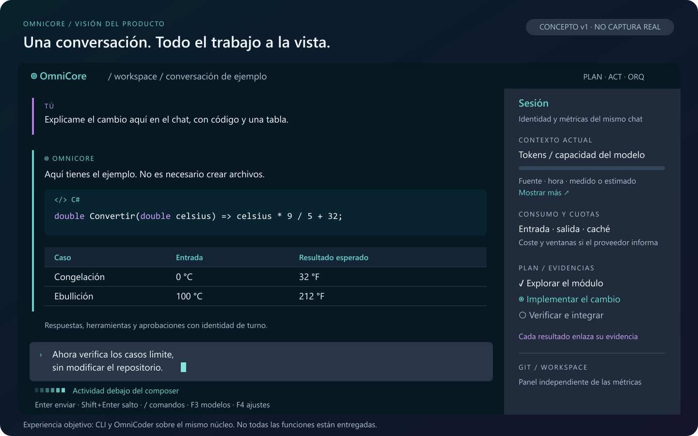
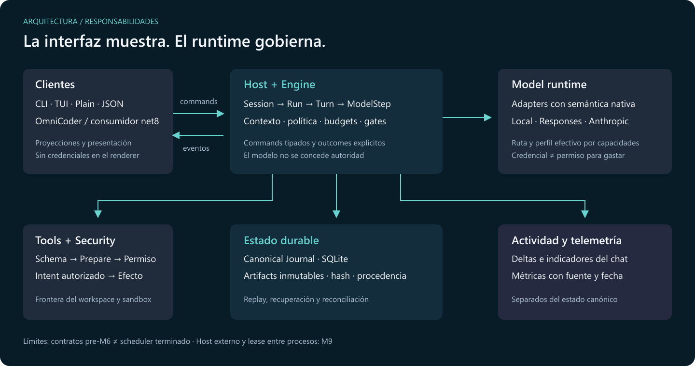
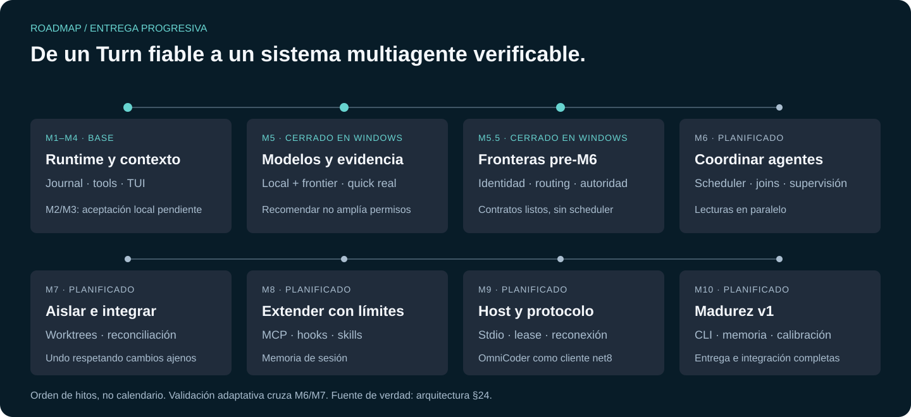

# OmniCore

### Un motor de agentes. Tus modelos. Tu workspace. Tu control.

OmniCore es un runtime **local-first en C#/.NET 10** para trabajar sobre repositorios con modelos locales o de frontera. Su primer cliente es el CLI `omni`; Protocol y Client también están preparados para consumidores como OmniCoder.

La meta es una conversación que conserva contexto, puede inspeccionar y modificar código dentro de permisos explícitos y entrega resultados respaldados por evidencia. Cambiar el modelo no debería exigir cambiar la tarea ni el motor.

[Primeros pasos](#primeros-pasos) · [Experiencia final](#la-experiencia-que-queremos-entregar) · [Estado actual](#estado-actual) · [Roadmap](#camino-hacia-v1) · [Documentación](#documentación)



*Diseño conceptual de v1, no una captura de la aplicación actual. Los textos y estados son ilustrativos: no representan consultas, mediciones ni ejecuciones reales.*

## La experiencia que queremos entregar

Una interfaz limpia para preguntar, planear, implementar y verificar sin perder la conversación ni ceder autoridad al modelo.

| Para ti | Lo que OmniCore debe garantizar |
|---|---|
| **Conversación útil** | Respuestas en el chat, código legible, tablas Markdown, referencias y resultados de herramientas. Una explicación no necesita crear archivos ni agentes hijos. |
| **Escritura cómoda** | Campo multilínea que crece, cursor visible, ayudas de comandos y navegación al último mensaje sin arrastrarte si estás leyendo el historial. |
| **Modelos a tu elección** | Selector sencillo para trabajar; mantenimiento separado para catálogo, visibilidad, perfiles y políticas. Sin sustituciones que amplíen gasto o permisos silenciosamente. |
| **Actividad comprensible** | Estados distintos para espera, razonamiento, respuesta, herramientas y aprobación; los indicadores se retiran al completar, cancelar, fallar o cambiar de sesión. |
| **Contexto y consumo claros** | Contexto actual separado del consumo acumulado; fuente y fecha; valores reportados, estimados o no disponibles identificados. |
| **Trabajo comprobable** | Plan y evidencias inspeccionables: una afirmación del modelo no equivale a un test ejecutado ni a una integración verificada. |
| **Continuidad** | Sesiones persistidas, recuperación tras interrupciones y artifacts verificables, sin duplicar efectos al reanudar. |

El lenguaje visual previsto combina superficies oscuras sobrias, acentos cian y violeta, selección clara y paneles sin marcos pesados. La conversación es protagonista; los detalles se despliegan cuando hacen falta.

### Un mismo núcleo, distintos clientes

- **TUI:** conversación interactiva en terminal, panel lateral, selección de modelos, comandos y aprobaciones.
- **Plain:** salida legible para terminales sencillos y flujos no interactivos.
- **JSON/NDJSON:** eventos y outcomes estructurados para automatización.
- **OmniCoder:** consumidor de Protocol y Client. Host separado, transporte y reconexión completos pertenecen al roadmap; no se presentan como producto final ya entregado.

Los clientes dibujan la experiencia. El Core decide estado, permisos, budgets y evidencia. Credenciales y consultas autenticadas no pertenecen al renderer.

## Cómo funciona



*Mapa de responsabilidades, no declaración de que scheduler, joins o transporte externo estén terminados.*

Una solicitud se convierte en un **Turn** dentro de una Session y un **Run**. El modelo recibe una proyección acotada del contexto y puede responder o solicitar herramientas. Cada herramienta pasa por validación, preparación y autorización antes de producir efectos. El estado relevante se registra para inspeccionarlo y reconstruirlo.

| Concepto | Qué significa |
|---|---|
| **Session / Run** | La sesión identifica la conversación; el Run conserva el trabajo activo hasta superar sus gates. |
| **Turn / ModelStep** | Una intención lógica puede necesitar varias llamadas al modelo. Suspender por una aprobación no debe perder pasos, contexto ni consumo. |
| **Task / Lane / AgentExecution** | Trabajo, camino de ejecución e instancia concreta. Scheduler M6 con lectores paralelos y escritoras serializadas en un Host compartido. |
| **ModelRoute / AgentProfile** | Cómo acceder al modelo y qué capacidades/política efectiva aplicar, sin permisos inventados por el modelo. |
| **Journal / Artifacts** | Eventos canónicos append-only para el estado; contenido inmutable identificado por hash para respuestas, contexto y evidencias. |
| **Completion Gates** | Condiciones verificables: «el modelo terminó» y «el trabajo está validado» son cosas diferentes. |

### Modos y autoridad

**PLAN, ACT y ORQ los elige el usuario.** El esfuerzo de razonamiento no cambia el modo, no habilita herramientas y no autoriza gasto por sí solo.

UltraCode es un preset de esfuerzo del producto, no un cuarto modo ni un modelo. Sólo una autorización explícita y durable permite transiciones de política acotadas. Consulta [las decisiones de modos y UltraCode](docs/adr/README.md) y [su contrato efectivo](docs/architecture/mode-proposals.md).

### Local-first no significa «todo gratis»

Se distinguen rutas locales, cuota incluida, facturación monetaria y condiciones desconocidas. Una credencial no equivale a autorización para gastar. Cuotas y créditos sólo se muestran cuando la fuente los informa: desconocido no es cero y saldo de cuenta no equivale al límite de una clave.

## Estado actual

Resumen documental al **10 de octubre de 2026**. La [arquitectura §24](docs/architecture/arquitectura.md) y las evidencias enlazadas son la fuente de verdad; este README no sustituye la aceptación de cada hito.

| Hito | Estado | Evidencia y alcance |
|---|---|---|
| **M1 · Runtime y planning** | Cerrado en Windows | Dominio, journal, permisos, simulación y reconciliación determinista. |
| **M2 · Explorer** | Código completo | Contexto y turnos persistidos; aceptación del usuario con su modelo local pendiente según [validación M1–M4](docs/validation/m1-m4.md). |
| **M3 · Mutaciones y procesos** | Código completo | Herramientas, fronteras y errores tipados; aceptación real local pendiente. Sandbox Strong en Linux diferido. |
| **M4 · Contexto y TUI v0** | Cerrado en Windows | [200 turnos, recuperación en otro proceso y TUI en PTY](docs/validation/m4-closure-20261005.md). No acredita reinicio de Windows ni validación Linux. |
| **M5 · Modelos y cualificación** | Cerrado en Windows | [Quick real de ChatGPT por suscripción y Qwen local](docs/validation/m5-closure-20261007.md). Una recomendación no modifica automáticamente la política. |
| **M5.5 · Fronteras pre-M6** | Cerrado en Windows | [Acta integral](docs/validation/m55-closure-20261007.md): continuidad protegida, cotas y autoridad, atribución, fingerprint, preimágenes y contratos. 2.958 PASS, 0 FAIL, 4 SKIP; arquitectura 56 PASS. |
| **M6 · Multiagente** | Cerrado en Windows | [Acta integral](docs/validation/m6-integration-20261008.md): Explore/Implement/Verify con Plan reconciliado, scheduler, budgets, joins/FanOut, supervisión/mailbox, background e inspector. [Revisión de cableado del 09-10](docs/validation/m6-wiring-audit-20261009.md): 3.292 PASS, 0 FAIL, 4 SKIP; arquitectura 56 PASS y recuperación M4 serial verde. Un Host compartido. |
| **M7 · Aislamiento** | En construcción | [Primer checkpoint y fases restantes](docs/validation/m7-isolation-20261010.md): backend Git y CLI de inspección; integración y lanes aisladas pendientes. |
| **M8–M10** | Planificados | Extensiones, Host separado y madurez v1. |

La evidencia de cierre M5 documenta **2995 casos: 2991 correctos, 0 fallos y 4 omitidos por permisos de symlink**. Es un resultado fechado, no un contador actualizado automáticamente aquí. Las pruebas con fixtures se distinguen de llamadas autenticadas reales.

### Modelos y proveedores

| Conexión | Implementación | Validación documentada |
|---|---|---|
| **ChatGPT por suscripción** | Login y Responses con perfil Codex | Quick autenticada real de la ruta documentada en M5. |
| **Local / llama.cpp** | Chat compatible, configuración y supervisión de host local | Quick real de Qwen en la configuración documentada; no cualifica automáticamente cualquier modelo local. |
| **OpenAI Responses API** | Adapter nativo | Fixtures; aceptación con API de pago no acreditada en el cierre M5. |
| **Anthropic Messages** | Adapter nativo y semántica del proveedor | Fixtures; aceptación autenticada de API pendiente. |
| **Créditos de otros proveedores** | Contratos de saldo de cuenta y límite de clave | Consulta real de créditos OpenRouter pendiente de una configuración validable. |

Disponibilidad y cuotas dependen de la cuenta y del proveedor en el momento de la consulta. No hay una lista universal de modelos garantizados para todos los usuarios.

## Primeros pasos

Necesitas **SDK de .NET 10** y Git. Protocol, Client y Sandbox también tienen target .NET 8 para OmniCoder. La TUI usa Terminal.Gui sobre el SDK oficial de .NET.

### Compilar y probar

```powershell
git clone https://github.com/juancgomezm-s/OmniCore.git
cd OmniCore
dotnet build OmniCore.slnx
dotnet test --solution OmniCore.slnx
```

### Explorar sin credenciales ni llamadas al modelo

```powershell
dotnet run --project src/OmniCore.Cli -- --help
dotnet run --project src/OmniCore.Cli -- sim
dotnet run --project src/OmniCore.Cli -- sim docs/sim/multi-item-plan.yaml --json
dotnet run --project src/OmniCore.Cli -- tui --sim
```

`sim` usa escenarios deterministas: permite conocer el lifecycle y los renderers sin atribuirle autenticación ni consumo real.

### Conectar y trabajar

Configura providers y modelos en el directorio **del usuario**, tomando [docs/examples](docs/examples) como referencia. No pegues credenciales en el repositorio. Las reglas de conexión y almacenamiento están en [los ADR](docs/adr/README.md), especialmente ADR-0011.

En la TUI, **F4 → Conexiones API de providers** permite guardar la API key de Anthropic, probar la conexión, descubrir modelos y desconectar. El Host conserva la credencial en su almacén protegido; guardar sin verificar muestra estado desconocido. Las fechas anteriores se identifican como históricas cuando la conexión actual no está validada. La cuenta ChatGPT conserva su acceso en el mismo menú de configuración.

```powershell
dotnet run --project src/OmniCore.Cli -- doctor
dotnet run --project src/OmniCore.Cli -- explain "¿Cómo está organizado este repositorio?"
dotnet run --project src/OmniCore.Cli -- ask "Explícame este módulo sin modificar archivos"
dotnet run --project src/OmniCore.Cli -- act "Corrige este test y verifica el resultado"
dotnet run --project src/OmniCore.Cli -- tui
```

`ask`, `act` y la cualificación real pueden llamar al proveedor: revisa primero ruta, facturación y permisos. `explain` permite inspeccionar el contexto materializado y su fingerprint.

### Atajos de la TUI

| Tecla | Acción |
|---|---|
| `Enter` / `Shift+Enter` | Enviar / salto de línea |
| `/` | Ayuda de comandos |
| `F2` / `F3` / `F4` | Panel lateral / elegir modelo / ajustes |
| `↑` / `↓` en el selector | Navegación vertical y circular |
| `Esc` en un menú | Cerrar el overlay |

### Pruebas focales

```powershell
# Driver real de Terminal.Gui, journals y proveedores de prueba
pwsh -File tools/test-conversation-rendering.ps1 -Snapshots

# Durabilidad SQLite, sin llamadas a proveedores
pwsh -File tools/test-sqlite-durability.ps1
```

La cualificación quick se ejecuta con `model qualify <modelo> --suite quick`; `--probe-timeout <segundos>` ajusta el límite por probe. Revisa [condiciones de reproducción](docs/validation/m5-closure-20261007.md) y [qué significa Qualified](docs/validation/m5-quick-qualification-scope.md) antes de hacer llamadas reales.

## Camino hacia v1



*Orden previsto, no calendario ni porcentaje de avance. Cada hito exige su propia evidencia.*

| Etapa | Lo que se pretende entregar |
|---|---|
| **M5.5 · Fronteras** | Continuidad sin perder uso ni identidad, rutas autorizadas, atribución precisa, separación de deltas y eventos, contratos congelados. |
| **M6 · Multiagente** | Explore, Implement y Verify diferenciables; scheduler, capacidad, joins, supervisión y budgets jerárquicos. Lecturas paralelas; escrituras serializadas hasta M7. |
| **M6/M7 · Validación adaptativa** | Evidencia de integración, validación inmediata y deuda visible. Un test unitario aislado no prueba todo el wiring. |
| **M7 · Aislamiento** | Worktrees, integración y undo de efectos atribuibles al runtime, respetando cambios posteriores del usuario. |
| **M8 · Extensiones** | MCP, hooks, skills y memoria de sesión sin ampliar autoridad. |
| **M9 · Host y protocolo** | Host separado, stdio, cliente net8, lease entre procesos y reconexión por secuencia sin pérdida ni duplicación. |
| **M10 · Madurez v1** | CLI pulido, memoria Project/Workspace/Global, búsqueda, keybindings, cualificación full, calibración e integración de OmniCoder. |

El producto final debe resolver una pregunta directa con cero herramientas, una edición controlada con pruebas o un workflow multiagente cuando aporte valor. No se fuerza una metodología de agentes a toda conversación.

## Garantías de diseño

- **El modelo propone; el runtime autoriza.** No ejecuta herramientas ni se concede permisos.
- **El repositorio no controla tus credenciales.** Un workspace no confiable no puede ampliar providers, sandbox o permisos.
- **Estado recuperable.** Journal append-only, artifacts verificables y reconciliación tras interrupciones.
- **Contexto con procedencia.** No se confunden datos base64 con texto ni consumo acumulado con ocupación actual.
- **Evidencia honesta.** Ausencia de cuota, precio, resultado o validación se muestra como ausencia.
- **UI desacoplada.** Terminal.Gui y Spectre.Console sólo en CLI; Protocol y Client sin framework visual.

Son reglas del producto, no una afirmación de aceptación total. Entre los diferidos están validación Linux, sandbox Strong en Linux y lease de sesión entre procesos en M9. El bloqueo de escritores cooperantes no es un compare-and-swap portable frente a cualquier editor externo.

## Organización del código

<details>
<summary>Ver proyectos y responsabilidades</summary>

| Proyecto | Responsabilidad |
|---|---|
| `OmniCore.Domain` | Identidades, entidades y eventos puros |
| `OmniCore.Abstractions` | Contratos públicos mínimos |
| `OmniCore.Engine` | Lifecycle, planificación, commands y gates |
| `OmniCore.Context` | Contexto, procedencia y compactación |
| `OmniCore.Models` | Adapters, registro, rutas y perfiles efectivos |
| `OmniCore.Qualification` | Probes, evidencia y recomendaciones |
| `OmniCore.Tools` | Catálogo y pipeline de herramientas |
| `OmniCore.Security` | Permisos, secretos y fronteras |
| `OmniCore.Execution` | Procesos y mecanismos de aislamiento |
| `OmniCore.Sandbox` | Aislamiento compartido con OmniCoder |
| `OmniCore.Infrastructure` | SQLite, artifacts y stores |
| `OmniCore.Protocol` | Commands, eventos y DTOs |
| `OmniCore.Host` | Composición y servidor |
| `OmniCore.Client` | Proyecciones y presentación sin framework |
| `OmniCore.Cli` | TUI, plain y JSON |

</details>

## Documentación

- [Especificación del producto](docs/spec/OmniCore-v1.md).
- [Decisiones de arquitectura](docs/adr/README.md): los ADR vigentes prevalecen sobre la spec.
- [Arquitectura, invariantes y roadmap](docs/architecture/arquitectura.md).
- [Cierre M4: contexto, recuperación y terminal](docs/validation/m4-closure-20261005.md).
- [Cierre M5: cualificación real](docs/validation/m5-closure-20261007.md).
- [Plan de aceptación M5.5](docs/validation/m55-closure-plan.md).
- [Contratos pre-M6](docs/architecture/pre-m6-record-contracts.md).
- [Propuestas de modo y autoridad](docs/architecture/mode-proposals.md).
- [Recuperación de los 42 archivos](docs/validation/recovered-worktrees-20261007.md).

Las imágenes son ilustraciones editables, no capturas de validación. [Fuentes y regeneración](docs/images/README.md).

## Licencia

OmniCore se distribuye bajo la [licencia MIT](LICENSE).
Copyright © 2026 Juan Gómez.

Los componentes de terceros conservan sus licencias y avisos originales;
consulta [THIRD-PARTY-NOTICES.md](THIRD-PARTY-NOTICES.md). Su inventario y los
textos upstream pendientes deben completarse antes de distribuir un paquete
que los incluya. La licencia MIT de OmniCore no sustituye esos términos ni
las condiciones de los proveedores o modelos conectados.
