# OmniCore — Arquitectura (revisión v0.6)

- **Fecha:** 2026-09-24 (revisión); 2026-09-25 (auditoría de M1); 2026-09-26 (cableado de M2 + cierre de bloqueantes); 2026-09-27 (cierre M2 e2e + decisiones 0044/0045)
- **Estado:** M1 implementado; M2 construido y cableado end-to-end (125 tests verdes, Windows).
- **Alcance:**
  - **v0.2:** decisiones P0/P1 (puntos 1–30), en §4–§24.
  - **v0.3:** extensibilidad, commands y memoria (puntos 31–41), en §25–§30. Además amplía las tablas de §21–§24.
  - **v0.4:** cliente interactivo UI/TUI (decisiones 42–51), en §31–§34, con ampliaciones en §21–§24.
  - **v0.5:** revisión integral + entrevista, en §35–§40. El roadmap de §24 queda consolidado como **fuente de verdad**.
  - **v0.6:** política operativa por modelo y cuestionarios estructurados (ADR-0044/0045), integrados en §11–§13, §22, §24 y §34.
- **Documentos:** [ADRs](../adr/README.md) · [Spec v0.6](../spec/OmniCore-v1.md)

La base conceptual se mantiene sin cambios:

```text
Session → Run → { Plan, TaskGraph → Task → Lane → AgentExecution → Turn }
```

Se conservan también el Context Engine, ToolCatalog/Planner/Plan/Router/Runtime, el Model Runtime, el Permission Engine, los Completion Gates, el Sandbox independiente, el Protocol separado, el Artifact Store, el runtime por eventos, Task/Lane como único camino para subagentes, los context snapshots, las extensiones (Skills/Hooks/Scope Resolver), `omni` como primer consumidor y la independencia de Pi y OmniCoder.

## Índice de entregables

| # | Entregable | Dónde |
|---|---|---|
| 1 | ADRs afectados | [README de ADRs](../adr/README.md). v0.2: 0001–0012 revisados y 0013–0021 nuevos. v0.3: 0009, 0017, 0019 y 0020 revisados; 0022–0029 nuevos |
| 2 | Spec principal | [OmniCore-v1.md](../spec/OmniCore-v1.md), v0.6 |
| 3 | Tests de arquitectura | v0.4: `OmniCore.Client` agregado al grafo, más un test que prohíbe Terminal.Gui y Spectre fuera de `OmniCore.Cli`. Dos tests más planificados para M1 (ADR-0009 §2) |
| 4–20 | Diagramas y diseños v0.2 | §4–§20 |
| 21 | Tabla de decisiones (puntos 1–41) | §21 |
| — | Clasificación de abstracciones | §22 |
| — | Open Architecture Questions | §23 |
| — | Roadmap M1–M10 revisado | §24 |
| 31–41 | Diagramas y diseños v0.3: scopes, extensiones, commands/keybindings, skills, tools, memory | §25–§30 |
| 42–51 | Diseños v0.4: capas del cliente, layout y responsive, sidebar y widgets, conversación, composer e interacciones | §31–§34 |

---

## 4. Canonical Journal

[ADR-0001](../adr/0001-canonical-journal.md) · [ADR-0002](../adr/0002-event-store-sqlite.md)

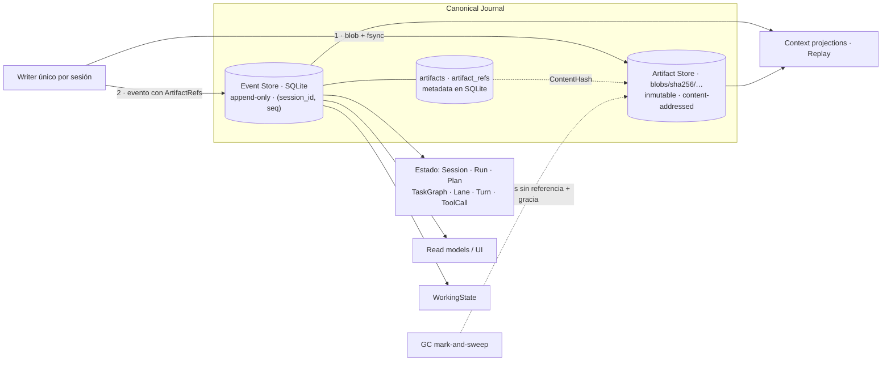

**Regla:** estado en eventos, contenido en artifacts. Un artifact perdido degrada el replay, nunca el estado.

## 5. Event schema vs Omni Protocol

[ADR-0013](../adr/0013-event-schema-vs-protocol.md)

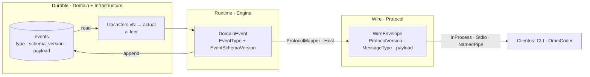

Un cambio en un lado no obliga a cambiar el otro: el mapper absorbe la diferencia.

## 6. ToolCall durable, Effect Journal y recovery

[ADR-0004](../adr/0004-resume-y-effect-journal.md) · [ADR-0002 §2](../adr/0002-event-store-sqlite.md)

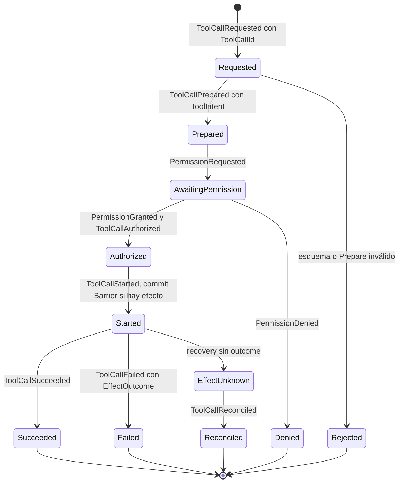

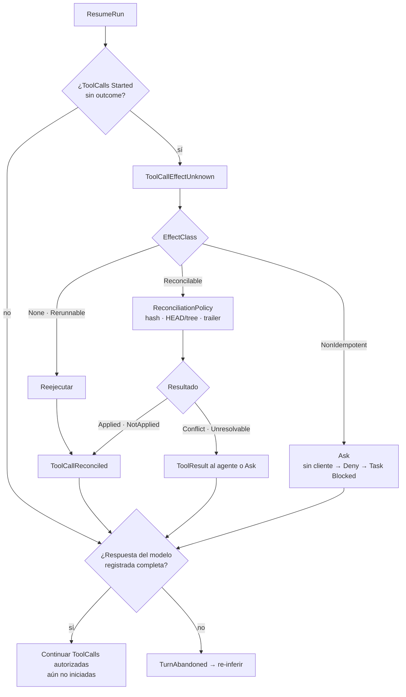

**Orden de durabilidad:**

1. Intent confirmado con **Barrier** (`ToolCallStarted`).
2. Efecto.
3. Outcome confirmado con Standard.

No hay transacción entre sistemas; la garantía es que todo intento de efecto queda registrado y se puede reconciliar.

## 7. Pipeline Raw ToolCall → Execute

[ADR-0014](../adr/0014-pipeline-tool-permission-execution.md)

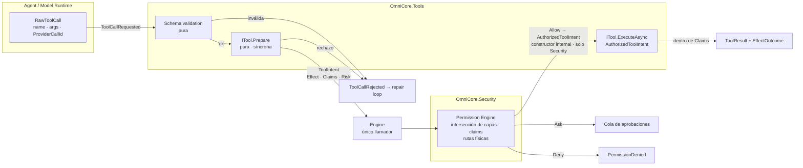

**Garantías estructurales:**

- `ExecuteAsync` solo acepta `AuthorizedToolIntent`, y solo Security puede construirlo.
- `Prepare` es síncrona y su contexto no expone servicios de I/O.

## 8. Process Runtime

[ADR-0015](../adr/0015-process-runtime.md)

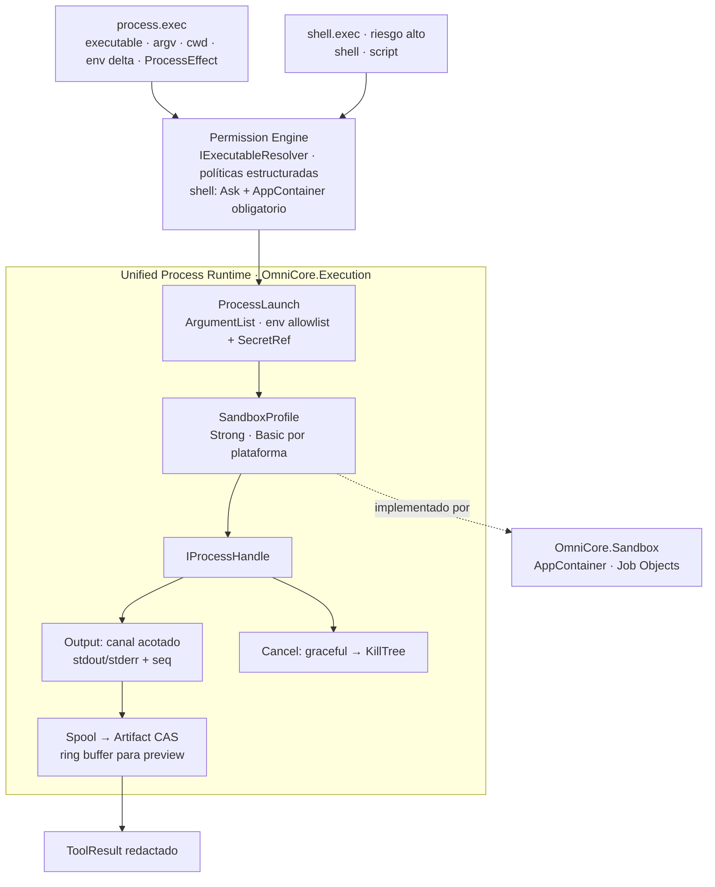

## 9. Model Provider architecture

[ADR-0005](../adr/0005-model-runtime-provider-native.md) · [ADR-0011](../adr/0011-conexion-a-proveedores.md)

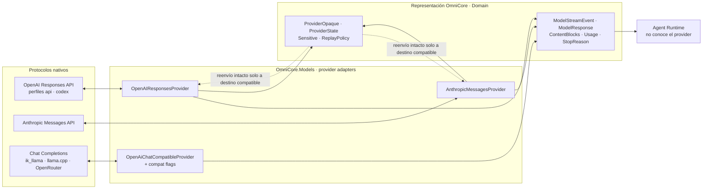

## 10. Contratos: ModelResponse, content blocks y estado opaco

Los contratos completos y la tabla "qué se normaliza, qué se persiste, qué entra al contexto y qué es sensible" están en [ADR-0005 §2–§4](../adr/0005-model-runtime-provider-native.md).

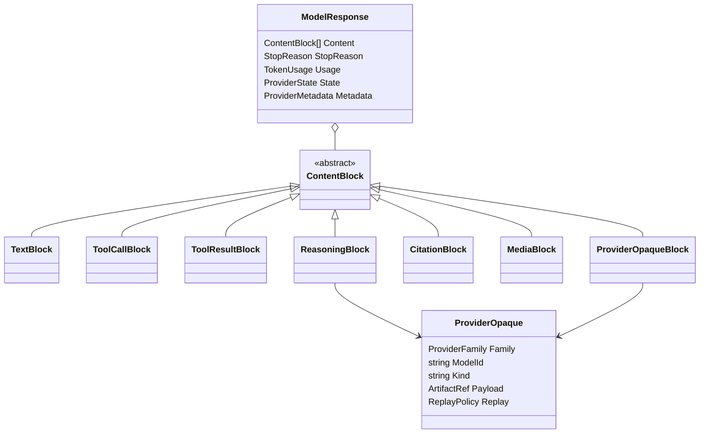

## 11. EffectiveModelProfile

[ADR-0007 §1–§3](../adr/0007-model-qualification-framework.md)

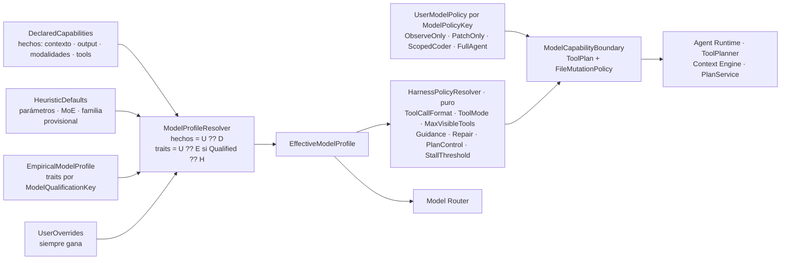

## 12. Model Qualification Framework

[ADR-0007 §4–§7](../adr/0007-model-qualification-framework.md)

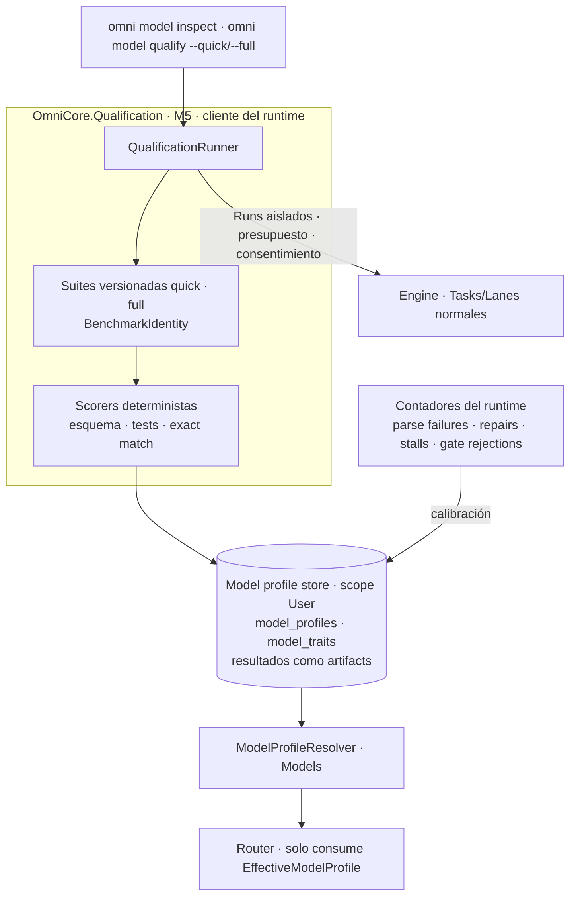

## 13. Qualification states y ModelQualificationKey

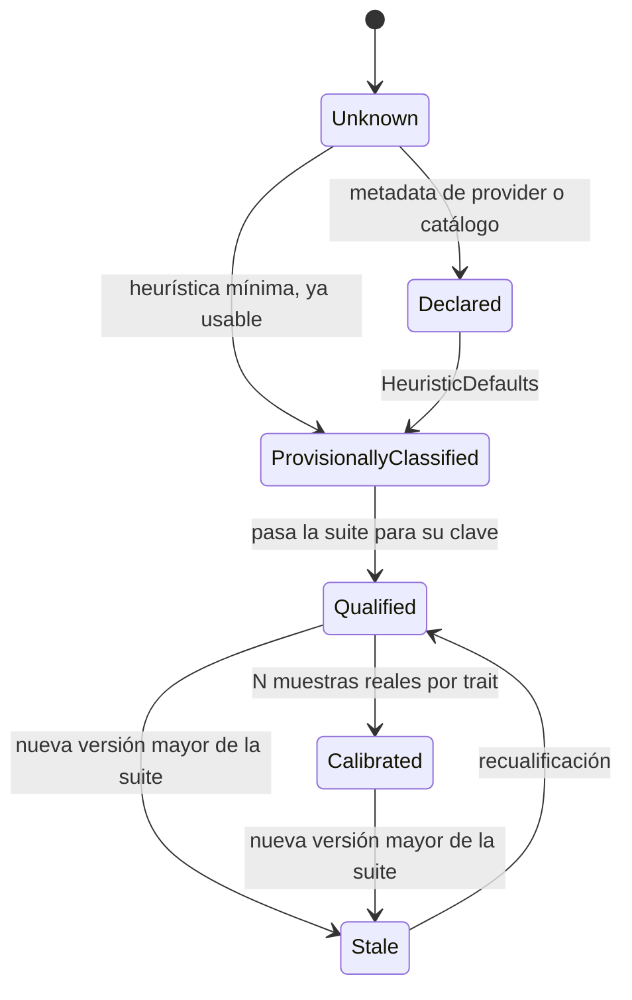

`ModelQualificationKey`:

- **Campos:** provider, modelo, revisión o hash de pesos, cuantización, adapters, backend y build, hash de chat template, perfil del adapter, `ToolCallFormat`, `ToolMode` y versión del prompt profile.
- **Identidad:** SHA-256 de la serialización canónica.
- **Detalle y ejemplos:** [ADR-0007 §5](../adr/0007-model-qualification-framework.md).

### 13.1. Política operativa por modelo

[ADR-0044](../adr/0044-politica-de-modelos-y-mutaciones.md) separa la calidad observada del techo
de autonomía elegido por el usuario. La preferencia se resuelve por `ModelPolicyKey` exacta y vive
en `user.db`; no es un grant de permisos. `ToolPlanner` reduce la superficie visible y
`ModelCapabilityBoundary` hace cumplir el límite aunque el modelo emita una tool oculta.

Los presets son `ObserveOnly`, `PatchOnly`, `ScopedCoder`, `FullAgent` y `Custom`. Una configuración
desconocida cae en `ObserveOnly`; la TUI/CLI solicita clasificación al seleccionarla. Las
preferencias son relacionales y deterministas. Un índice vectorial futuro solo puede sugerir una
clasificación a partir de evidencia similar, nunca autorizarla.

## 14. Run → Plan y Run → TaskGraph

[ADR-0016 §1–§2](../adr/0016-plan-y-working-state.md)

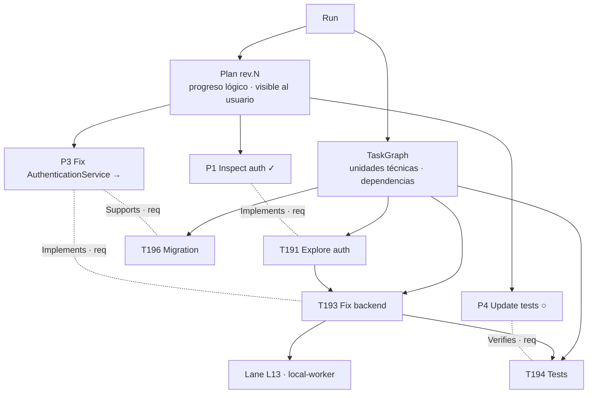

La relación es N:M. Un PlanItem puede requerir varias Tasks, y una Task puede servir a varios items.

## 15. ProgressReconciler

[ADR-0016 §5, §9](../adr/0016-plan-y-working-state.md)

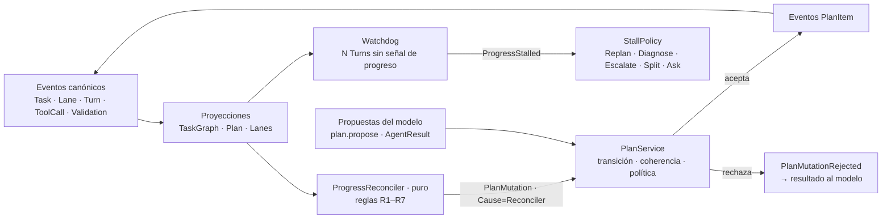

| Regla | Disparador | Transición |
|---|---|---|
| R1 | Una Task vinculada pasa a `Running` | `Pending`/`Ready` → `InProgress` |
| R2 | Todas las Tasks requeridas `Completed`, y las `Verifies` OK | → `Completed` |
| R3 | Una Task requerida `Blocked` | → `Blocked` |
| R4 | Se desbloquea | `Blocked` → `InProgress` |
| R5 | Una Task requerida `Failed`, con recovery agotado | → `Failed` o `Blocked` según la `FailurePolicy` |
| R6 | Dependencias `Completed`/`Skipped` | `Pending` → `Ready` |
| R7 | El item actual es terminal | Se recalcula el item actual |

## 16. PlanCompletionGate

[ADR-0016 §10](../adr/0016-plan-y-working-state.md)

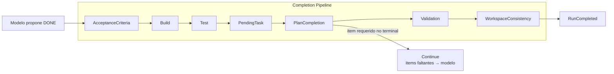

| Estado de un item `Required` | ¿Permite completar? |
|---|---|
| `Completed` | Sí |
| `Skipped` / `Cancelled` por transición válida con política | Sí |
| `Pending`, `Ready`, `InProgress`, `Blocked` | **No** |
| `Failed` | El Run termina `Failed`, o `CompletedWithIssues` si la `FailurePolicy` es `AllowPartial` |

## 17. Plan y WorkingState en el Context Engine

[ADR-0016 §7](../adr/0016-plan-y-working-state.md) · [ADR-0017](../adr/0017-execution-fingerprint.md)

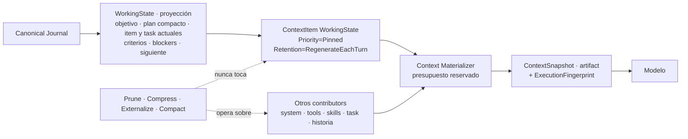

- **Orden del contexto para el prompt caching:** system → tools → skills → task → historia → **WorkingState** → turno actual. El WorkingState cambia en cada Turn, así que va al final para no invalidar el prefijo cacheado.
- **Supervivencia:** sobrevive a compaction, rebuild, cambio de modelo y resume, porque se regenera desde el Journal.

## 18. Permission y Sandbox boundaries

[ADR-0008 §7](../adr/0008-sandbox-compartido.md) · [ADR-0009](../adr/0009-grafo-de-dependencias.md) · [ADR-0014](../adr/0014-pipeline-tool-permission-execution.md)

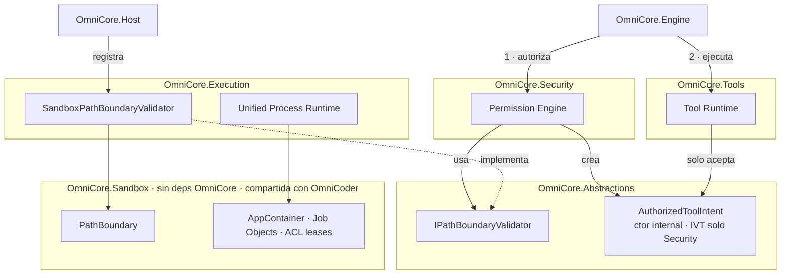

**Sin aristas nuevas en el grafo:** Security → Abstractions; Execution → Sandbox (ya existía).

## 19. SecretProvider y redacción

[ADR-0018](../adr/0018-secretos-y-redaccion.md)

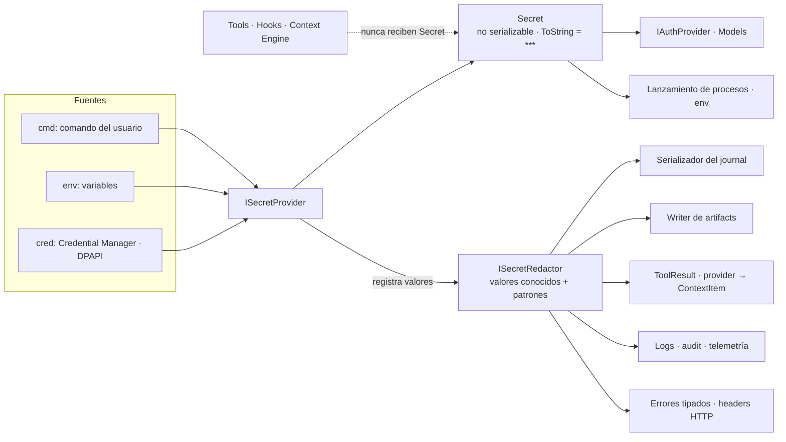

## 20. CLI → Transport → Host → Engine

[ADR-0019](../adr/0019-cli-transport-host.md)

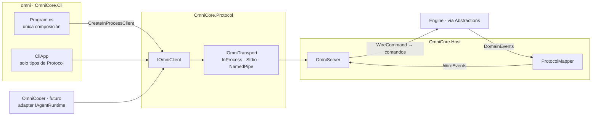

---

## 21. Tabla de decisiones

| # | Decisión | Estado anterior | Cambio | Razón | Impacto M1–M10 |
|---|---|---|---|---|---|
| 1 | Fuente canónica | "Eventos = única fuente de verdad" (ADR-0001 rev. 1) | Canonical Journal = Event Store + artifacts inmutables content-addressed; estado en eventos, contenido en artifacts; retención por Session, GC y detección de corrupción | Snapshots, outputs y `ProviderState` viven en artifacts y también son historia | M1: envelope + tipos. M2: CAS simple. M4: GC y verify |
| 2 | Versionado | `EngineEvent.ProtocolVersion` mezclaba dos cosas | `EventType` + `EventSchemaVersion` (durable) separados de `ProtocolVersion` + `MessageType` (wire); upcasters y `ProtocolMapper` | Evolucionar CLI o protocolo sin migrar el store, y viceversa | M1: columnas + mapper mínimo. M9: negociación |
| 3 | Crash consistency | Resume por Turn completo (ADR-0004 rev. 1) | Effect Journal: `ToolCallId` estable, ciclo de vida durable, `EffectUnknown`, `ReconciliationPolicy` por clase | Repetir una tool con efectos no es seguro | M1: ciclo de vida en el dominio. M3: FS. M7: Git |
| 4 | Pipeline de tools | `ValidateAsync` + `ExecuteAsync(ToolCall)` | `Prepare` puro → `ToolIntent` → Permission → `AuthorizedToolIntent` (solo Security lo construye) → `ExecuteAsync` | Ejecutar sin autorización debe ser imposible por tipos | M1: contratos + `FakeTool`. M2: tools reales |
| 5 | Procesos | `shell.exec` como primitive | `process.exec(executable, argv[], cwd, env)`; shell como superficie de riesgo alto con `Ask` + AppContainer; runtime unificado | No interpretar strings de shell para autorizar | M1: tipos. M3: runtime |
| 6 | Model Runtime | Un provider OpenAI-compatible como base (ADR-0005 rev. 1) | Tres familias nativas (Responses, Messages, Chat-compatible); `ContentBlocks` + `ProviderOpaque`/`ProviderState` | No perder semántica de providers (firmas de thinking, reasoning cifrado) | M1: contratos en Domain. M2: Chat-compatible. M5: Responses y Messages |
| 7 | Perfil de modelo | 4 categorías por parámetros (ADR-0007 rev. 1) | Declared + Heuristic + Empirical + Overrides → `EffectiveModelProfile` → `HarnessPolicy` | El tamaño no predice el comportamiento (MoE, cuantización, tuning) | M2: resolver sin empíricos. M5: MQF |
| 8 | Estados de cualificación | — | `Unknown → Declared → ProvisionallyClassified → Qualified → Calibrated` (+ `Stale`) | Usable de inmediato y mejorable con datos | M2: estados. M5: suite |
| 9 | Identidad de cualificación | — | `ModelQualificationKey` (pesos, cuantización, backend, plantilla, adapter, `ToolMode`, prompt profile) | La cualificación es de una configuración concreta | M2: clave. M5: store |
| 10 | Suite de cualificación | — | Perfiles `quick`/`full`, deterministas, nunca automática, consentimiento en providers de pago | Cualificar sin tocar Router ni runtime | M5: quick. M10+: full y calibración |
| 11 | Security ↔ Sandbox | Contradicción entre ADR-0008 y ADR-0009 | `IPathBoundaryValidator` en Abstractions; implementación en Sandbox; adapter en Execution | Sin ciclos, sin duplicar, sin P/Invoke en Security | M2 |
| 12 | Plan como estado de primera clase | No existía | `Run → Plan` + `Run → TaskGraph`; `PlanItem ↔ Task` N:M | El seguimiento no puede depender de la memoria del modelo | **M1** |
| 13 | Modelo de Plan | — | `Plan`/`PlanItem`/`PlanItemLink`, 8 estados | Estado estructurado y reconstruible | **M1** |
| 14 | Mutaciones | — | El modelo propone `PlanMutation`; `PlanService` valida, aplica política y emite eventos | INV-002 aplicado al plan | M1: service. M2: `plan.propose` |
| 15 | Eventos de Planning | — | `PlanCreated` … `PlanItemReordered`, `PlanMutationRejected`, `ProgressStalled` | Reconstrucción y métricas | **M1** |
| 16 | Sincronización TaskGraph ↔ Plan | — | `ProgressReconciler` puro con R1–R7 | Sin depender de que el modelo "recuerde" | **M1** |
| 17 | Revisiones | — | `Plan rev.N`; impacto `Minor`/`Moderate`/`ScopeExpansion`/`RequiredSkip`, con `Ask` para las dos últimas | Cambios de scope visibles y controlados | M1: revisiones. M2: `Ask` |
| 18 | WorkingState | — | Proyección `Pinned` y regenerada en cada Turn, al final del contexto | Sobrevive a compaction, cambio de modelo y resume | M1: proyección. M2: en contexto |
| 19 | ProgressReconciler | — | Componente explícito tras cada cambio relevante | Coherencia determinista | **M1** |
| 20 | PlanCompletionGate | — | Nuevo gate en el pipeline; estado de Run `CompletedWithIssues` | El modelo propone DONE; el runtime decide | **M1** |
| 21 | Watchdog | — | `ProgressStalled` tras N Turns sin señal; `StallPolicy` | Evitar agentes girando en falso | M1: detección. M2: políticas |
| 22 | Trait de plan | — | `PlanTrackingReliability` en el MQF, que alimenta `PlanControl` | Ajustar cuánto controla el runtime según el modelo | M2: `PlanControl`. M5: medición |
| 23 | CLI de planning | `/plan` era un modo | `/plan` (vista lógica) y `/tasks` (vista técnica) desde la primera versión útil | Plan y TaskGraph son UX distintas | M1: `omni sim` + `/plan` `/tasks` |
| 24 | Durabilidad | WAL + `NORMAL` para todo | Commits Standard vs **Barrier** antes de efectos; sin ACID entre sistemas | El intento de efecto debe sobrevivir a un corte de energía | M1: contrato. M3: uso |
| 25 | `ArtifactRef` | Id, MediaType, Size, Kind | + `ContentHash`, `Sensitivity`; CAS | Integridad, dedupe, replay | M1: tipos. M2: CAS |
| 26 | Fingerprint | `ContextSnapshot.ModelDescriptorHash` | `ExecutionFingerprint` por componentes en `TurnStarted` | Explicar qué configuración recibió cada Turn | M1: tipo. M2/M5/M8: componentes |
| 27 | Secretos | `ICredentialStore` + redactor genérico (ADR-0011) | `ISecretProvider` + `Secret` no serializable + redactor obligatorio en cada sink | Imposible persistir un secreto por accidente | M1: journal. M2: resto |
| 28 | CLI y composition root | `OmniHost.RunAsync(CliClient.RunAsync)` | CLI → `IOmniClient`/`IOmniTransport` → Host → Engine, incluso in-process | Mismo CLI para InProcess, stdio y pipes | M1: in-process. M9: stdio |
| 29 | Hooks | Solo INV-014 | Niveles de confianza unificados (Core/Trusted/Project/ThirdParty/Untrusted, ADR-0023), capacidades explícitas, `HookResult` sin ampliación | Hooks de terceros sin acceso a secretos ni estado privado | M8 |
| 30 | Worktrees | `.omnicore/worktrees/<lane>` sin semántica de workspace sucio | `WorktreeBase` (por defecto `SnapshotOfWorkingTree`), worktrees fuera del repo, integración 3-way sin pisar cambios | La Lane ve lo que ve el usuario | M7 |
| 31 | Commands | Lista de `/` commands en el CLI | Subsistema formal (ADR-0024): `CommandDescriptor`/`Registry`/`Handler`; kinds Client, Engine, Prompt, Workflow, Extension; el Engine nunca interpreta `/`; precedencia con nombres reservados y restricción de confianza | Commands de extensiones y proyectos sin colisiones silenciosas; mismo catálogo para CLI y OmniCoder | M1: mínimo. M2: Prompt. M6: Workflow. M8: Extension y precedencia |
| 32 | Keybindings | No existía | `ClientAction` como unidad única; `KeyBindingService` con `When`/`Priority`/`Source`; Command Palette (ADR-0025), solo cliente | Un solo sistema de acciones para teclado, texto y palette | M1: interrupt y cancel. M10: configurable, palette |
| 33 | Skills | Formato + activación (spec §52–§53) | Scopes BuiltIn→Session; ciclo de vida `Discovered → Eligible → Activated → Loaded → Released`; costo cero si solo está instalada; precedencia con `sealed` y confianza (ADR-0026) | No consumir contexto por estar instalada; conflictos visibles | M8 |
| 34 | Extensiones | "Plugin" sin contrato | Paquete con manifest versionado; ejecución fuera de proceso vía Extension API (JSON-RPC); `TrustLevel` unificado Core/Trusted/Project/ThirdParty/Untrusted; capa `ExtensionBoundary` (ADR-0023) | No acoplar extensiones al Host ni a tipos .NET internos | M1: tipos. M8: host |
| 35 | Origen de tools | ToolCatalog sin origen | `ToolDescriptor.Source` + `Protection`; `ToolId` con namespace por origen; built-ins sensibles no sustituibles sin preferencia explícita + `Ask` (ADR-0027) | Ninguna extensión reemplaza en silencio `filesystem.write` | M1: tipos. M2: planner. M8: preferencias |
| 36 | Memory fuera del Core | §54: "no parte del Core" | Working Context (Context Engine) separado de Session/Project/Workspace/Global Memory; memoria solo vía `IContextContributor`; el runtime funciona sin ella (ADR-0028) | Núcleo determinista | M8+ |
| 37 | `MemoryRecord` | — | Contrato con scope, kind, importance, confidence, provenance, expiración y `Supersedes`; recuperación `retrieve → rank → dedupe → budget` | No last-write-wins | M8+ |
| 38 | Memory / Knowledge / Skills | Mezclados en §52–§54 | Tres conceptos con storage, ciclo de vida y políticas propios | Evitar que "todo sea contexto" sin reglas | M1: `ContextItemKind`s |
| 39 | Promoción de memoria | — | `Observation → MemoryCandidate → MemoryPolicy → Promote/Reject/Ask`; Global siempre `Ask`; Project requiere evidencia | El LLM no promociona solo | M8+ |
| 40 | Memory en el contexto | — | `MemoryContextContributor` con slot propio en `ContextBudget`; `WorkingState` pinned y separado | Cientos de memorias no entran al prompt | M8+ |
| 41 | Diagnósticos | `/context` sin origen | `ContextProvenance` en cada `ContextItem`; `/context` por categoría; `/commands`, `/keybindings`, `/skills`, `/extensions`, `/memory` (ADR-0029) | Explicar qué contribuyó a una ejecución sin exponer contenido sensible | M1: tipos. M2: `/context`, `/tools`. M8/M10: resto |
| 42 | Tecnología de la TUI | No definida | Terminal.Gui v2 (2.5.0) como dueño de la TUI y Spectre.Console (0.57.2) para renderables y modo plain; ambos `net10.0`; solo en `OmniCore.Cli` (ADR-0030) | Frameworks maduros, sin acoplar el Core | Track TUI después de M3 (v0.5) |
| 43 | Capa de presentación | CLI con lógica propia | Proyecto nuevo `OmniCore.Client` (solo depende de Protocol) con `ClientProjection` como reducer puro y único estado para TUI y plain; JSON emite eventos del protocolo (ADR-0030) | Un solo estado para todos los renderers; reutilizable por OmniCoder | **M1** |
| 44 | Layout | — | 4 zonas: header (cwd dominante + git compacto), conversación + sidebar, composer, status line como última línea (ADR-0031) | Arquitectura de información estable | M2 |
| 45 | Status line | — | `StatusLineModel` + `UsageSnapshot` con `MetricAvailability`; cuota nunca inferida (`—`); `ProviderCapabilities.UsageReporting` | No mostrar datos inventados | M1: tipos. M5: costo y cuota |
| 46 | Sidebar | — | `SidebarHost` + `ISidebarWidget` con `Evaluate`/`Build` → `WidgetModel` declarativo; visible/auto/expanded/priority; widgets de extensión declarativos (ADR-0032) | Sidebar multipropósito, no panel de Plan | M2: Session/Plan. M3: Files. M6: Agents. M8: extensiones |
| 47 | Responsive y tema | — | Modos `Stacked`/`Tabbed`/`Overlay` por breakpoints configurables; `ThemeRole` semánticos + glyphs Unicode/ASCII; color nunca como única señal; `NO_COLOR` (ADR-0031) | Terminales de cualquier tamaño y accesibilidad | M2 |
| 48 | Conversación | — | `ConversationBlock`s semánticos que se actualizan en su lugar; `ToolPresentation` como metadata, sin UI en las tools; verbosidad Normal/Verbose/Trace solo en el renderer (ADR-0033) | Actividad legible, no un log crudo | M1: plain. M2: TUI |
| 49 | Composer y referencias | `SendInput(text)` | `SendInput { InputPart[] }` con `TextPart`/`ReferencePart`; `@file`, `@folder`, `@task`, `@lane`, `@artifact`, `@skill` resueltos por el Host con permisos y procedencia (ADR-0033) | Las referencias no dependen de texto literal | **M1**: forma del protocolo. M2/M3: resolución y autocompletado |
| 50 | Human-in-the-loop | `Ask` abstracto (ADR-0003) | `InteractionRequest` / `RespondToInteraction` con payload discriminado: choice simple o cuestionario; `user.ask`; single/multi/texto/`Otro`; overlay sin destruir `MainView`; Lane en `WaitingForPermission` o `WaitingForInput` (ADR-0034/0045) | Un mecanismo durable para permisos, conflictos, cambios de scope, memoria y preguntas del modelo | M1: choice DTOs. **M3:** cuestionario + plain. **M4:** overlay TUI |
| 51 | Acciones de cliente | Lista mínima (ADR-0025) | Acciones iniciales (sidebar, palette, vistas, modelo, búsqueda, inspector, diff, interrupt/cancel, cerrar overlay); menús también resuelven a `ClientAction` | Un solo sistema de input | M1: interrupt/cancel. M10: configurable |
| — | Scopes e identidades | Jerarquía de §51 sin estrategias | `ScopeLevel`, `ProjectId` (repo) ≠ `WorkspaceId` (carpeta local), estrategia de resolución por subsistema (ADR-0022) | Listas de scopes distintas por subsistema; memoria multi-repo | **M1**: identidades para ubicar el journal |

## 22. Clasificación de abstracciones

| Necesaria desde M1 | Contract now / implementation later | Fully deferable |
|---|---|---|
| Ids fuertemente tipados (UUIDv7) | CAS en disco (M2) y GC (M4) | Dedupe entre workspaces |
| Envelope de evento (`EventType`, `EventSchemaVersion`, causation/correlation, `ArtifactRefs`) | `verify-journal` y `ArtifactRedacted` (M4) | Cifrado en reposo de `Sensitive` |
| `IEventStore` + `SqliteEventStore` + `InMemoryEventStore` | Commit Barrier en uso (M3) | Lease de escritor entre procesos (OAQ-2) |
| Session, Run (+ `CompletedWithIssues`), Task, TaskGraph, Lane, Turn y sus máquinas de estado | `ReconciliationPolicy` FS (M3) y Git (M7) | Reconciliación de APIs específicas |
| **Plan, PlanItem, PlanItemLink, PlanMutation, PlanService, ProgressReconciler, PlanCompletionGate, WorkingState, watchdog** | `plan.propose` y `PlanControl` (M2) | Clasificación semántica del impacto |
| Ciclo de vida de ToolCall, `EffectClass`, `EffectOutcome` | Tools reales (M2/M3), `IProcessRuntime` (M3) | Analizador Roslyn para `Prepare` |
| `ITool` (`Prepare`/`ExecuteAsync`), `ToolIntent`, `ResourceClaims`, `AuthorizedToolIntent` | `shell.exec` (M3) | PTY/ConPTY |
| Contratos de modelo en Domain (`ContentBlock`, `ModelResponse`, `ProviderOpaque`) | Adapters (M2/M5) | Media, citations, documentos |
| Tipos `EffectiveModelProfile` y `HarnessPolicy` | Resolver (M2), MQF, key y store (M5) | Traits no mínimos |
| `ExecutionFingerprint` (tipo) | Componentes reales (M2+) | `omni turn explain` |
| `SecretRef`, `Secret`, redactor en el serializador del journal | `ICredentialStore` y redacción completa (M2) | Detección heurística de secretos |
| `IOmniClient` + `InProcessTransport` + `ProtocolMapper` mínimo | Stdio (M9), negociación de versión | Named Pipes, clientes remotos |
| `IsolationPolicy` e `IsolationHandle` (solo tipos) | Worktrees (M7) | `DirectoryCopy` sin git |
| — | Hooks: niveles y capacidades (M8) | Firma de plugins, marketplace |
| `ScopeLevel`, `WorkspaceId`, `ProjectId` (v0.3) | `IScopeResolver<T>` con estrategias por subsistema (M2/M8) | Scope `Organization` |
| `TrustLevel`, `SourceKind`, `ComponentSource`; `ToolDescriptor.Source`/`.Protection` (v0.3) | Manifest y Extension API (M8), `ExtensionBoundary` (M8) | Carga in-process de `Trusted`, marketplace |
| Regla "el Engine no interpreta `/`", `CommandInvocation`, `ClientCommandRegistry` mínimo (v0.3) | `CommandRegistry` del Host + precedencia (M8), Prompt (M2), Workflow (M6), Extension (M8) | Completers avanzados |
| `ClientAction` + bindings de interrupt/cancel (v0.3) | `KeyBindingService` configurable, palette (M10) | Combinaciones concretas restantes |
| `ContextProvenance`, `ContributionCategory`, `ContextItemKind.Memory`/`Knowledge` (v0.3) | Skills (M8), Memory (M8+), `/context` por categoría (M2) | Búsqueda vectorial, dedupe semántico, diff de contexto |
| `OmniCore.Client`, `ClientProjection`/`ClientState`, `PlainRenderer`, `JsonRenderer` (v0.4) | TUI Terminal.Gui v0 + `SpectreSegmentAdapter` (M2) | Desktop, animaciones |
| `SendInput { InputPart[] }`, DTOs choice de `InteractionRequest`/`RespondToInteraction`, `UsageSnapshot`/`Metric<T>`, `ThemeRole`, `ConversationBlock` básicos (v0.4) | Cuestionarios tipados + `user.ask` (M3), `QuestionnaireOverlay` (M4), `ISidebarWidget` y widgets (M2–M8), `ToolPresentation` (M2), `ReferenceResolver` (M2+), responsive (M4) | Paleta y temas finales |

## 23. Open Architecture Questions

Solo las decisiones realmente abiertas. Todo lo demás está decidido en los ADRs.

### OAQ-1 — Ubicación de los datos de runtime por workspace · **RESUELTA** (2026-09-24)

> **Decisión:** el usuario aprobó la opción B. Queda registrada en ADR-0022 §3. El análisis se conserva como referencia.

**Problema:** M1 crea el Event Store, y M2 el Artifact Store. Hay que decidir dónde viven el journal, los blobs, los worktrees (ADR-0021) y los grants con lifetime `Project`. La spec sugiere `.omnicore/` dentro del repo.

**Alternativas:**

| | A · `.omnicore/` dentro del repo | B · Directorio por usuario: `%LOCALAPPDATA%\OmniCore\workspaces\<workspace-id>\` | C · Una sola base global de usuario + blobs por workspace |
|---|---|---|---|
| Visibilidad | Alta, junto al código | Media (`omni doctor` muestra la ruta) | Media |
| Riesgo de commitear datos o secretos | **Alto** (depende de `.gitignore`) | Nulo | Nulo |
| Las tools del agente indexan sus propios datos y worktrees | Sí; hay que excluirlos en todas partes | No | No |
| Permisos del sistema operativo | Heredados del repo | ACL del perfil de usuario | ACL del perfil de usuario |
| Portabilidad con el repo | Se mueve con la carpeta | Requiere resolver la identidad del workspace | Igual que B |
| Purga por workspace | Borrar la carpeta | Borrar la carpeta | Consultas de borrado en una base compartida |
| Contención entre workspaces | Ninguna | Ninguna | Una sola base para todo |

**Recomendación: B.**

- **Estructura:** `%LOCALAPPDATA%\OmniCore\workspaces\<workspace-id>\{journal.db, blobs\, worktrees\}`.
- **Identidad del workspace** (*refinada en v0.3, ADR-0022*): `WorkspaceId` = primeros 16 hex de SHA-256 de la **ruta canónica de la raíz abierta**. Un registro `workspaces.json` mapea id → ruta, lo que permite re-vincular si la carpeta se mueve.
- **Identidad del proyecto:** `ProjectId` se deriva de la URL `origin` normalizada, del `git-common-dir` o de la raíz, y es compartido por todos los clones y worktrees. Sus datos no versionables (memoria de proyecto, grants `Project`) van en `%LOCALAPPDATA%\OmniCore\projects\<ProjectId>\`.
- **Workspaces multi-repo:** un workspace con varios repos tiene un solo journal y varios `ProjectId`.
- **Datos de scope User:** van en `user.db` en el directorio de datos de la plataforma, que incluye perfiles de modelo (ADR-0007) y memoria Global. Los grants se guardan según ADR-0037 §5 (Session en el journal; Workspace en la configuración local del workspace).
- **`.omnicore/` en el repo** queda **solo** para configuración versionable del proyecto (settings, skills, hooks) y nunca para datos de runtime.

**Trade-offs:** se pierde "todo junto al repo" a cambio de seguridad (sin riesgo de commitear historia con contenido sensible) y limpieza. Además, ningún glob del agente tiene que excluir los datos de OmniCore.

**Decisión sugerida:** aprobar B.

### OAQ-2 — Escritor único por sesión entre procesos · DEFERABLE (hasta M9)

En M1–M8 un solo proceso escribe. Cuando CLI y OmniCoder puedan abrir la misma sesión, harán falta un lease en `journal.db` (tabla `session_leases` con heartbeat) o un lock file por sesión. Se decide con el Host separado (M9).

### OAQ-3 — Clasificación semántica de `ScopeExpansion` · DEFERABLE (M2+)

Las reglas estructurales de M1/M2 cubren los casos claros. Una clasificación semántica (por ejemplo, con el MetaModelService) se evalúa con datos reales.

### OAQ-4 — Defaults de retención · RESUELTA (M4)

Defaults confirmados en código: auditoría 180 días (`AuditRetention.DefaultRetentionDays`) y gracia de GC de 24 horas (`ArtifactGc.DefaultGrace`).

### OAQ-5 — Contenido y umbrales de la suite de cualificación · DEFERABLE (M5)

Qué probes componen `quick`, los umbrales de trait → `HarnessPolicy` y el tamaño de muestra para `Calibrated`. Los contratos ya están congelados.

### OAQ-6 — Cómo consume OmniCoder (net8) a OmniCore · **RESUELTA** (2026-09-24)

`OmniCore.Protocol`, `OmniCore.Client` y `OmniCore.Sandbox` compilan para `net10.0;net8.0` (decisión del usuario, ADR-0038 §6). OmniCoder no necesita migrar.

### OAQ-7 — Capacidades reales de ik_llama por request · IMPLEMENTATION DETAIL (M2)

Hay que verificar en vivo `grammar`/`json_schema` por request, tool calls con `--jinja` y `/health`. El diseño ya lo trata como capacidad declarada y probada.

### OAQ-8 — Costo del commit Barrier en Windows · IMPLEMENTATION DETAIL (M3)

Hay que medir si conviene alternar `synchronous` o usar una conexión dedicada con `FULL`. La semántica ya está decidida.

### OAQ-9 — Interrupción limpia de procesos hijos en Windows · IMPLEMENTATION DETAIL (M3/M6)

`CTRL_BREAK_EVENT` con grupo de procesos nuevo, frente al interrupt por protocolo en las lanes de Claude Code. La semántica (graceful → kill del árbol) ya está decidida.

### OAQ-10 — Relación entre la Extension API y MCP · DEFERABLE (M8)

Para las tools, la Extension API podría ser un superconjunto de MCP (reutilizar su framing y su `tools/list`) o un protocolo propio con un adaptador MCP.

- **Qué ya está decidido:** la frontera (fuera de proceso, versionada, sin tipos .NET) y el manifest.
- **Qué falta:** el framing concreto se decide al implementar el host de extensiones.

### OAQ-11 — Derivación de `ProjectId` con varios remotos o sin `origin` · IMPLEMENTATION DETAIL (M1)

Por defecto se usa `origin`; si no existe, el primer remoto en orden alfabético; y si no hay remotos, el `git-common-dir`. **Corrección (revisión integral):** el override manual **no** vive en el repo; vive en el `settings.yaml` local del Workspace (ADR-0039 §2), porque `ProjectId` no debe poder fijarse desde un repo ajeno.

### OAQ-12 — Pesos de ranking y umbrales de promoción de memoria · DEFERABLE (M8+)

La fórmula `relevancia × importance × confidence × recencia × afinidad` y las N ocurrencias para promover a Project se calibran con datos reales. Los contratos ya están congelados.

### OAQ-13 — Spectre dentro de la TUI · IMPLEMENTATION DETAIL (spike al inicio del track TUI, después de M3)

En modo TUI, Terminal.Gui es dueño de la consola, así que los renderables de Spectre se traducen de `Segment`s a atributos de Terminal.Gui con `SpectreSegmentAdapter`.

- **Qué se valida:** fidelidad de estilos, ancho de caracteres Unicode y CJK, y rendimiento con diffs grandes (virtualización).
- **Si el spike falla:** los diffs y tablas de la TUI usan vistas nativas de Terminal.Gui (`TableView`, `TreeView`) y Spectre queda solo para el modo plain. El contrato de `ClientProjection` no cambia.

### OAQ-14 — Fuentes de cuota por provider · DEFERABLE (M5)

Qué providers informan cuota y cómo:

- créditos de OpenRouter;
- headers de rate limit de OpenAI y Anthropic;
- límites de la suscripción ChatGPT.

El contrato (`Metric<QuotaInfo>` con `NotSupported` → `—`) ya está congelado.

### OAQ-15 — Compatibilidad AOT de Terminal.Gui v2 y YamlDotNet · IMPLEMENTATION DETAIL (track TUI / M2)

Hay que verificar si Terminal.Gui v2 y el generador estático de YamlDotNet publican sin warnings con Native AOT.

- **Si no lo hacen:** el binario se publica self-contained sin AOT, que es el camino por defecto; AOT es una opción, no un requisito (ADR-0038 §5).
- **Spike 2026-09-29 (Windows x64):** Terminal.Gui 2.6.0-develop.61, YamlDotNet 18.1.0 y Vecc.YamlDotNet.Analyzers.StaticGenerator 18.1.0 publican con `PublishAot` e `IsAotCompatible` con **0 warnings IL2xxx/IL3xxx**. El exe resultante ocupa unos 10,5 MB y va acompañado de `libonigwrap.dll`; arranca e inicializa. Veredicto: **AOT viable**, con cuatro condiciones:
  - fijar la versión exacta de Terminal.Gui, porque es un prerrelease `develop` y su API cambia entre builds;
  - repetir la prueba en Linux y confirmar que se empaqueta el `.so` nativo;
  - un job de CI que publique con AOT y falle ante cualquier IL2xxx/IL3xxx;
  - ampliar la prueba a `OptionSelector`/`RadioGroup` y al binding de `ListView`, que quedaron sin probar.

  Para enlazar en Windows, `vswhere.exe` tiene que estar en el PATH.

### OAQ-16 — Sandbox fuerte en macOS · DEFERABLE (v1.x)

Seatbelt (`sandbox-exec`) o una alternativa. En v1, macOS usa sandbox `Basic` con `WeakSandboxConsent`.

## 24. Roadmap M1–M10 (fuente de verdad)

> **Consolidado en la revisión integral v0.5.**
> - Reemplaza la tabla anterior y sus dos tablas de agregados (v0.3 y v0.4).
> - La spec §86–§95 y §99 solo lo resumen; ante cualquier diferencia, **prevalece esta tabla**.
> - Principio: se implementa solo lo que el milestone usa; los contratos "Necesaria desde M1" (§22) se congelan en M1.

| Milestone | Contenido | Criterio de salida |
|---|---|---|
| **M1 — Runtime sin IA + Planning** — ✅ **CERRADO EN WINDOWS** (2026-09-30; verificación en Linux diferida por decisión del usuario) | **Dominio:** ids tipados, `ScopeLevel`, `WorkspaceId`/`ProjectId` con rutas canónicas (ADR-0038 §4); Session, Run, Plan/PlanItem, Task/TaskGraph, Lane, Turn, ToolCall y sus máquinas de estado (ADR-0036); conversación ↔ Run, modos y cancelación (ADR-0035).<br>**Journal:** envelope, `EventType`, upcasters vacíos, `SqliteEventStore` + `InMemoryEventStore`, `IArtifactStore` simple (ADR-0041 §3), rutas de plataforma (ADR-0038/0039).<br>**Plan:** `PlanService`, `ProgressReconciler` R1–R7, watchdog, Completion Pipelines de Lane y de Run, `WorkingState`.<br>**Permisos:** tipos + `ScriptedPermissionPolicy` + `AuditSink` básico.<br>**Contratos congelados** (§22), incluidos `ITokenCounter` + `FakeTokenCounter`, `InteractionRequest` con eventos de dominio y `LocalizedText`.<br>**Cliente:** `OmniCore.Client` (`ClientProjection`), plain renderer interactivo (con pregunta en línea) y JSON renderer, recursos `es`/`en`.<br>**Simulación:** `omni sim` + escenarios YAML + golden rule.<br>**Tests de arquitectura:** IVT solo Security, referencias IL del CLI, multi-target | Los escenarios de `omni sim` (plan de varios items, TaskGraph N:M, `Ask`, crash + resume) se reconstruyen idénticos desde el journal, en **Windows y Linux** |
| **M2 — Explorer** — 🟢 **CÓDIGO COMPLETO** (2026-09-30; falta la validación manual con el modelo local) | **Modelo local:** `OpenAiChatCompatibleProvider` (ik_llama), `LocalModelHost` attach + managed, `IProcessRuntime` mínimo (control del árbol de procesos), registro mínimo de modelos + `NoModelConfigured`.<br>**Configuración:** YAML + schemas, Scope Resolver de configuración, confianza de workspace (ADR-0039).<br>**Seguridad:** `ISecretProvider` + `ICredentialStore` por plataforma; Permission Engine v1 (defaults autónomos, grants por `WorkspaceId`, `/permissions`, topes de gasto); `IPathBoundaryValidator` por plataforma; audit store.<br>**Modelo y contexto:** `EffectiveModelProfile` (Declared + Heuristic + Overrides) + `HarnessPolicy`; token counters reales; Context Engine v1 (`WorkingState`, `SessionConversationContributor`, política provisional de ADR-0042); `ContextSnapshot` + fingerprint.<br>**Tools:** pipeline real, read tools, `reference.resolve`, CAS v1, `ToolPresentation`.<br>**Planificación y diagnóstico:** `plan.propose`, `PlanApproval` (PLAN → ACT), `PromptCommand`, `/context` y `/tools` | Pendiente la ejecución real de `omni "explícame este repositorio"` con el modelo local (requiere la API key del usuario) |
| **M3 — Native Coder** — 🟢 **CÓDIGO COMPLETO** (2026-09-30; falta la validación manual) | `filesystem.write` y `patch` con tokens de versión; límites de mutación por Turn de ADR-0044 §5 (`BeginTurn` al iniciar cada Turn); `RequirePostEditValidation` exige un gate Build/Test posterior a la última edición; Coder vía `omni act` con gates Build/Test/Acceptance desde configuración tipada (`argv[]`). `process.exec`/`shell.exec` usan el launcher del sandbox; Strong en Windows (AppContainer + Job Object, grants ACL serializados) y `WeakSandboxConsent`; `process.exec` rechaza `.bat`/`.cmd`. ADR-0045 end-to-end: `user.ask` suspende el Turn y la respuesta vuelve como `ToolResult`; formulario plain TTY y `InputRequired` sin TTY. Effect Journal recupera efectos huérfanos incluso de Runs terminales; no inicia otro Run si quedan efectos sin reconciliar, permite resolución humana con `omni resolve`, y lecturas interrumpidas o simulaciones no bloquean falsamente. | Código completo (errores de tool con `ToolErrorCode` tipado, persistido en los eventos v2). Pendientes: sandbox Strong en Linux (diferido) y la ejecución real del criterio `omni act "corrige este test"` con el modelo local (`docs/validation/m1-m4.md`) |
> **Estado ADR-0045:** integración end-to-end verificada. `user.ask` suspende el Turn; tras responder, el mismo Turn recibe la respuesta como `ToolResult`. El formulario plain TTY está cableado y, sin TTY, el flujo termina con `InputRequired` sin inventar una respuesta.
| **M4 — Context management** — 🟢 **CERRADO EN WINDOWS** (2026-10-05; + **track TUI v0**) | Prune, Externalize, Compress y Compact con `MetaModelService` + `ContextCheckpoint`; GC, `verify-journal`, purga de sesiones y auditoría (retención de 180 días; gracia de GC de 24 h); herramienta para releer artifacts externalizados.<br>**TUI v0:** Terminal.Gui 2.6.0-develop.61, 4 zonas, sidebar, overlays, autocomplete, cuestionarios y onboarding. [Evidencia de cierre](../validation/m4-closure-20261005.md): sesión controlada de 200 turnos sobre SQLite/CAS, recuperación en proceso distinto y TUI de producción en PTY 80×25/120×35 | Contexto acotado; WorkingState, checkpoints y cuestionario pendiente sobreviven al reinicio de Omni; journal verificado y append-only; paridad single/multi/texto/`Otro` y onboarding cubiertos por wiring. Validación de terminal automatizada autorizada por el usuario. No implica cualificación de proveedores, cierre M2/M3/M5, validación Linux ni reinicio de Windows |
| **M5 — Models + Qualification** — ✅ **CERRADO EN WINDOWS** (2026-10-07; [evidencia](../validation/m5-closure-20261007.md): suite `quick` real sobre ChatGPT por suscripción y Qwen local, ambos `Qualified`, recomendación sin cambiar la política) | `OpenAIResponsesProvider` (perfiles `api` y `codex`, **login ChatGPT**); `AnthropicMessagesProvider` (`ProviderOpaque`); registro completo + alias; router + escalación; `OmniCore.Qualification` + suite `quick`, estados y store; `FileMutationReliability` y recomendación de categoría; costo y cuota reales en la status line; calibración de estimaciones de tokens | Cambiar de worker local a frontier sin modificar la Task; cualificar un modelo sin cambiar el runtime; la evidencia puede recomendar pero nunca ampliar automáticamente su política operativa |
| **M5.5 — Fronteras pre-M6** (ADR-0046) — 🟡 **EN CURSO** (2026-10-06) | **Fase A, bugs** ([gap-pre-m6.md §4](gap-pre-m6.md#4-bugs-que-no-dependen-del-anexo)): timestamp UTC; `ArtifactRefs` del envelope; `ContextPolicyHash` del fingerprint; estado opaco descartado y `Continuation` nula; input perdido al reanudar un Turn; uso perdido al suspender; escalación `auto` sin autorización; topes de ADR-0037 §7; `PendingEditValidation` durable.<br>**Fase B, contratos:** Turn de 1..N `ModelStep`; `FollowUp`/`Steering` explícitos; `ModelRoute` (ruta por defecto 1:1) y perfil/qualification key por ruta; `ReasoningReplayPolicy`; `SessionRoutingPolicy` + `BillingMode` + consentimiento vía `InteractionRequest` (cierra el modo `ask` de escalación); `ExecutionScope` en el envelope, `Source` y causation real; `ITelemetrySink` separado del journal; `CommandOutcome` + commands internos (el Host deja de escribir el journal por fuera); `toolcall.started` v3 con reversibilidad y pre-imagen; componentes del fingerprint; **tipos y eventos congelados** de `AgentExecution` (lineage, Awaited/Detached, Managed), Delegation/Escalation/Wake, `AgentResult` inmutable + `ResultDisposition`, `JoinPolicy` | Criterios de ADR-0046: un Turn multi-paso con suspensión cuenta todos los pasos; el estado opaco solo se reenvía a la misma ruta; una Session `Local` no puede acabar en una ruta de pago sin consentimiento; todos los eventos de una ToolCall están atribuidos a Task/Lane/Turn; solo el servidor escribe el journal (test de arquitectura); los eventos de M6 congelados serializan y se reproducen; los deltas nunca llegan al journal |
| **M6 — Multi-agent** | Descomposición, scheduler de lanes, lanes background, heartbeat agregado; **`AgentExecution` con lineage**, `ContextInheritancePolicy` (por defecto `SelectedProjection`; la herencia nunca amplía autoridad ni visibilidad); `FanOutGroup` + `FanInPolicyEvaluator` determinista (`Direct`/`Aggregate`); `ExecutionJoin` (`All/Any/Quorum/Explicit`); `AgentResult` por schema (`core.explorer.v1`, …) + `ResultDisposition` (aceptación explícita si es Managed); `SupervisionBinding` + handshake + `SupervisionFailurePolicy` (por defecto `Wait`; nunca degrada en silencio a Unmanaged); `ExecutionMailbox` + `WakePolicy` determinista (sin polling con LLM); presupuesto jerárquico + `RunBudgetPool`; `CapacityScheduler` (FIFO + prioridad + recursos reales, `WaitingForCapacity`); `WorkflowCommand`, tools `Dynamic`, `core.agents` + `LaneInspector` (TUI). **Solo las lanes de lectura corren en paralelo**; las escritoras se serializan con un lease de escritura hasta M7 | Explore + Implement + Verify como Tasks diferenciadas, con el Plan reconciliado; además, los flujos de ADR-0046/anexo §37–38 con supervisor fake en proceso: padre suspendido hasta que el join se cumple; supervisor caído observable y sin aceptación implícita; capacidad agotada → `WaitingForCapacity`; presupuestos limitan hijo y Run; el routing no escapa de la `SessionRoutingPolicy`; módulo sin cablear → `ReworkRequested` |
| **M6/M7 — Validación adaptativa** | `ImmediateValidation` (diagnósticos baratos tras editar); niveles de completion (`Local/Integration/Project/EndToEnd`); `EvidenceRef` (claim vs respaldada por tool), `IntegrationStatus`, `ValidationState` + `ValidationDebt` durables (`CompletedWithValidationDebt` visible); gates `IntegrationGate` y `WorkspaceConsistencyGate`. Core define los registros; la detección de wiring por lenguaje y el `ChangeRiskAssessment` (M7+) los aportan OmniCoder o extensiones | Un test unitario aislado no satisface un `IntegrationGate`; la falta de evidencia nunca se presenta como verificación |
| **M7 — Isolation** | Worktrees con `SnapshotOfWorkingTree`, integración 3-way, reconciliación Git, cleanup; **lanes escritoras paralelas**; **lanes delegadas a Claude Code** (ADR-0012 rev. 3, riesgo residual aceptado); **`WorkspaceSnapshotStore` + `UndoService`/`UndoPlan`** (restore, compensación y conflictos; solo efectos atribuibles a OmniCore, nunca `git reset --hard`) | Coders concurrentes sin pisar el workspace ni los cambios del usuario; un undo con cambios ajenos posteriores pide resolución en lugar de destruirlos |
| **M8 — Extensibility** | Host de extensiones (`OmniCore.Extensions`) + manifest YAML + `ExtensionBoundary`; **MCP** con las reglas de confianza de ADR-0023; hooks; ciclo de vida de skills; `CommandRegistry` con precedencia + `ExtensionCommand`; `toolPreferences`; **Session Memory**; `/commands`, `/skills`, `/extensions`, `/memory session` | Un hook o extensión puede restringir pero no ampliar, verificado por test |
| **M9 — Protocol + Host** | `StdioTransport`, negociación de `ProtocolVersion`, Host separado, lease entre procesos, read models persistidos; integración de OmniCoder vía Protocol y Client en net8; **reconexión "after sequence N" por stream**; **procedencia y fidelidad de historial** (`Native`/`Imported`, `Complete`/`Partial`); supervisor de OmniCoder por el transporte real | El mismo CLI funciona in-process y por stdio; un cliente net8 se conecta; reconectar no duplica ni pierde eventos |
| **M10 — CLI v1 + memoria + evaluación** | **Memoria Project, Workspace y Global** con promoción (toda la memoria en v1); keybindings configurables, Command Palette, `session.search`; suite `full` + calibración; regression suite; comparación con Pi; adapter de OmniCoder; **`/undo`**, inspección de `AgentExecution`, estado de supervisión, capacidad y `ValidationDebt` como proyecciones | Criterios de madurez de la spec §96 |

**Cambios frente a los roadmaps anteriores:**

- Planning y persistencia entran en M1.
- M1 agrega los componentes mínimos de simulación (ADR-0041).
- M2 incorpora el Scope Resolver de configuración, el `IProcessRuntime` mínimo, el registro mínimo de modelos y los topes de gasto.
- La TUI sale de M2 y pasa a un track después de M3.
- Las lanes de Claude Code pasan de M6 a M7.
- En M6 solo corren en paralelo las lanes de lectura.
- Toda la memoria entra en v1.
- **2026-09-30 (ADR-0046):** nuevo hito M5.5 con las fronteras pre-M6 y los bugs encontrados en la auditoría
  ([gap-pre-m6.md](gap-pre-m6.md)). M6 incorpora joins, supervisión, mailbox/wake, presupuestos y capacidad.
  Nuevo track M6/M7 de validación adaptativa. Undo físico en M7. Reconexión y procedencia de historial en M9.

### Estado real por epic

> **Estado contrastado con código y tests:** la tabla distingue lo implementado de los criterios de salida
> que aún requieren validación real. Última ejecución de `dotnet test --solution OmniCore.slnx`: 1112 tests
> (1108 correctos, 4 omitidos por las restricciones del entorno para crear symlinks).

| Epic | Estado | Lo principal que falta |
|---|---|---|
| **M1** | | |
| 001 Ids, identidades, rutas | Hecho | `WorkspaceId`/`ProjectId` reales con resolución de symlinks de la raíz y tests |
| 002 Eventos y store | Hecho | Causation/Correlation en el envelope, Barrier con WAL + `synchronous=FULL` (con test), `AppendBatch` transaccional, upcasters, JSON por generador |
| 003 Máquinas de estado | Hecho | `CanonicalStateTracker` valida al escribir y al reproducir; actividad de Lane derivada; PlanItem padres derivados de sus hijos |
| 004 Conversación ↔ Run y cancelación | Hecho | `SendInput`, `Interrupt`, `CancelRun`, `RespondToInteraction`; no arranca un Run con efectos sin reconciliar |
| 005 PlanService | Hecho | Política de impacto, `PlanRevised`, Split/Link/Ready |
| 006 Reconciler y watchdog | Hecho | R1–R6 corregidos; watchdog por Turns sin progreso con umbral configurable |
| 007 Completion | Hecho | Gates de Run y de Lane; un requerido fallido no termina en `Completed`. Sin evento propio de rechazo de Lane (se usa `RunValidationRejected` con gate `lane`) |
| 008 Permisos y auditoría | Hecho | `Ask` respondido por el escenario; auditoría append-only en JSONL, scope User (`<data>/audit/`) |
| 009 Contratos congelados | Hecho | Fingerprint SHA-256 en `TurnStarted` (también simulado); `Secret` no serializable; `LocalizedText` en uso |
| 010 Cliente | Hecho | `ClientProjection` sobre el journal real vía `ProtocolMapper`; es/en |
| 011 `omni sim` | Hecho | Escenarios YAML completos y golden rule real (live vs replay) |
| Tests de arquitectura de M1 | Hecho | IVT de Abstractions solo para Security; `omni.dll` solo referencia Protocol, Client y Host |
| Pendiente de M1 | Diferido | Verificación en Linux (sin distro en WSL, decisión del usuario 2026-09-29) |
| **M2** | | |
| 012 Provider, host local, procesos | Hecho | SSE real, JSON por generador, `ProviderOpaque` conservado, reintentos y circuit breaker (por instancia); key del servidor gestionado por entorno (`LLAMA_API_KEY`) |
| 013 Config, scopes, confianza | Hecho | YAML tipado con generador estático y schemas; resolución por scopes con `locked`; confianza de workspace por `WorkspaceId`; formato `auth` anterior aceptado como obsoleto |
| 014 Secretos y redacción | Hecho | Redacción por valores conocidos (también Base64/URL) en el codec del journal, artifacts, contexto y logs. Secret Service/Keychain pendientes |
| 015 Permission Engine | Hecho | Grants de Run y de workspace (solo levantan `Ask` de UserPolicy/perfil), `/permissions`, topes de gasto con precios de config y gasto derivado del journal, entorno de procesos por allowlist |
| 016 Perfil y tokens | Hecho | Conteo exacto con `/tokenize` (llama.cpp/ik_llama por tipo de provider), estimación con margen del 10 %, caché por tokenizer |
| 017 Contexto | Hecho | Conversación presupuestada, `WorkingState` al final también con recorte, snapshot referenciado desde `TurnStarted` |
| 018 Pipeline de tools | Hecho | `filesystem.list` y `search.text` sin recorrer enlaces fuera del workspace; validación de argumentos por schema antes de `Prepare` para todas las tools; tools `Protected` no sustituibles |
| 019 Artifact store (CAS) | Hecho | CAS con marca `Redacted`; GC, `verify-journal`, purga y herramienta de relectura de outputs externalizados |
| 020 Explorer | Hecho en código | `/context`, `/tools`, `PromptCommand` (`/explain`), `PlanApproval` real con el Run en espera; test del criterio exige un turno correcto. Falta la prueba real con el modelo local |
| **M3** | | |
| 021 write/patch | Hecho | `filesystem.write` y `patch` con tokens de versión, compare-and-swap bajo lock por ruta, escritura atómica, cancelación, límites por Turn y `ToolErrorCode` tipado |
| 022 Effect Journal y Barrier | Hecho | Barrier efectivo en el pipeline con journal; recuperación reconcilia efectos huérfanos también de Runs terminales; se rechaza iniciar otro Run si quedan efectos sin reconciliar; `omni resolve` permite resolución humana. Las lecturas interrumpidas y las simulaciones sin efectos no bloquean; `ExecuteTool` exige `EventStream` |
| 023 Sandbox, `process.exec`, `shell.exec` | Hecho en Windows | Launcher Strong con AppContainer + Job Object y ACL grants serializados; ejecución vía sandbox, `WeakSandboxConsent`; `process.exec` rechaza `.bat`/`.cmd`. Pendiente: sandbox Strong en Linux (diferido) |
| 024 Coder y gates | Hecho en código | `omni act` Coder loop y gates Build/Test/Acceptance desde config tipada con `argv[]`; criterio real con el modelo local pendiente |
| ADR-0044 (política de modelos) | Hecho | Límites de mutación por Turn y `RequirePostEditValidation` aplicados en el flujo de completion |
| ADR-0045 (cuestionarios) | Hecho end-to-end | `user.ask` suspende el Turn; la respuesta vuelve como `ToolResult`; formulario plain TTY y `InputRequired` sin TTY |
| **M4** | | |
| 025 Context management y mantenimiento | Hecho | Prune/Externalize/Compress/Compact con MetaModelService y ContextCheckpoint; GC, `verify-journal`, purga de sesiones, retención de auditoría (180 días; gracia GC 24 h) y relectura de artifacts externalizados |
| TUI v0 | Cerrada en Windows (2026-10-05) | Terminal.Gui 2.6.0-develop.61; 4 zonas, sidebar, overlays, autocompletado, cuestionarios y onboarding. Wiring y uso de terminal automatizado en PTY real, con autorización del usuario; [evidencia y límites](../validation/m4-closure-20261005.md) |
| **M5** | | |
| Providers nativos | Hecho | `AnthropicMessagesProvider` (SSE, thinking firmado opaco solo al mismo modelo, `cache_control`) y `OpenAIResponsesProvider` (`store:false`, razonamiento cifrado opaco); resiliencia HTTP compartida; las tres familias conectadas en el Host |
| Login ChatGPT (perfil `codex`) | Hecho | OAuth + PKCE en loopback y device code (endpoints configurables), tokens cifrados, refresh serializado entre procesos, `omni login/logout chatgpt`, estado en `omni doctor`. Validado con cuenta real el 2026-10-07 (cualificación `quick` de `gpt-5.6-sol`) |
| Registro, alias y router | Hecho | Alias con ambigüedad tipada en `models.yaml`; `routing:` por tipo de tarea con `preferLocal`; ADR-0044 impide mandar tareas escritoras a modelos sin política; `ModelEscalation*` con causa; el modo `ask` con consentimiento vía `InteractionRequest` se completó en M5.5 |
| Cualificación | Hecho | `omni model qualify` (suite `quick`, consentimiento, tope de costo, `--probe-timeout`), store por `ModelQualificationKey`, capa Empirical del perfil; la recomendación nunca amplía la política. Ejecutada contra providers reales el 2026-10-07 |
| Status line y tokens | Hecho | Costo `≈$` con precio declarado, cuota solo informada (cabeceras de rate limit), `—` sin dato; calibración de la estimación con los conteos exactos de `/tokenize`; cuota de suscripción en la status line. Créditos de OpenRouter diferidos hasta que haya un provider de OpenRouter configurado (el contrato ya los admite) |
| **M5.5** | En curso | Contratos y correcciones parciales verificados; cierre pendiente de todos los criterios de ADR-0046. Seguimiento: [plan de cierre](../validation/m55-closure-plan.md) |
| **M6–M10** | Sin empezar | Según el roadmap |

> **TUI v0:** implementada sobre `ClientProjection` con Terminal.Gui 2.6.0-develop.61. Incluye 4 zonas,
> sidebar, overlays, autocomplete de `/` y `@`, onboarding de modelos y cuestionario. La resolución de
> referencias `@` aún no está disponible. La validación de uso de M4 en Windows se completó mediante
> terminal automatizada autorizada por el usuario; no implica cualificación de modelos ni validación Linux.


---

# Revisión v0.3 — extensibilidad, commands y memoria

## 25. Modelo de scopes

[ADR-0022](../adr/0022-modelo-de-scopes.md)

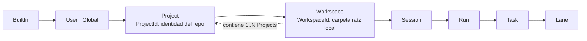

| Subsistema | Estrategia de resolución |
|---|---|
| Configuración | El más específico gana, salvo claves `locked` |
| Permisos | Intersección |
| Commands, tools, skills | Especificidad + restricción de confianza + reservados/protegidos/`sealed` |
| Hooks | Unión ordenada; las restricciones se intersectan |
| Memoria | `retrieve → rank → dedupe → ContextBudget` |

## 26. Modelo de extensiones

[ADR-0023](../adr/0023-modelo-de-extensiones.md)

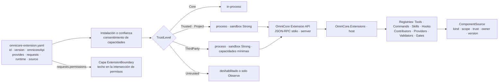

## 27. Commands, Client Actions y keybindings

[ADR-0024](../adr/0024-commands.md) · [ADR-0025](../adr/0025-client-actions-keybindings.md)

```mermaid
flowchart LR
  subgraph CLIENT["Cliente · OmniCore.Cli"]
    TXT["Texto '/review x'"] --> PAR["Parser de commands"]
    KEY["Teclado"] --> KBS["KeyBindingService<br/>When · Priority · Source"]
    PAL["Command Palette"]
    CCR["ClientCommandRegistry"]
    ACT["ClientAction"]
    INV["CommandInvocation"]
    CCR --- PAR
    PAR --> INV
    KBS --> ACT
    PAL --> ACT
    PAL --> INV
    INV -->|"ClientCommand"| ACT
  end
  subgraph HOSTC["Host"]
    CR["CommandRegistry<br/>Engine · Prompt · Workflow · Extension"]
    CSV["CommandService<br/>expansión · validación"]
  end
  INV -->|"otros kinds"| CSV
  ACT -->|"run.cancel · run.interrupt"| WC["WireCommand"]
  CSV --> WC
  CSV -->|"PromptCommand"| SI["SendInput o StartRun con Origin"]
  CR -->|"ListCommands"| PAR
  WC --> ENG["Engine · nunca interpreta '/'"]
  SI --> ENG
```

## 28. Ciclo de vida de skills

[ADR-0026](../adr/0026-skills.md)

```mermaid
stateDiagram-v2
  [*] --> Discovered: escaneo del scope, solo skill.yaml
  Discovered --> Eligible: activación coincide
  Discovered --> Activated: invocación explícita
  Eligible --> Activated: SkillSelector dentro de límites
  Activated --> Loaded: contribuciones materializadas
  Loaded --> Released: deja de ser relevante
  Released --> Eligible: vuelve a coincidir
  Eligible --> Discovered: deja de coincidir
```

El costo de contexto es cero en `Discovered` y `Eligible` (salvo la línea opcional del índice) y solo aparece en `Loaded`.

## 29. Origen y precedencia de tools

[ADR-0027](../adr/0027-tool-sources-y-precedencia.md)

```mermaid
flowchart TB
  REGT["Registro de tool<br/>ToolId con namespace por SourceKind"] --> DUP{"¿Id duplicado?"}
  DUP -->|"sí"| REJ["ToolRegistrationRejected"]
  DUP -->|"no"| CAT["ToolCatalog"]
  CAT --> PL["ToolPlanner"]
  PREF["toolPreferences explícitas · scope User"] --> PL
  PL --> PROT{"¿Reemplaza una built-in Protected?"}
  PROT -->|"sin preferencia"| KEEP["Se usa la built-in"]
  PROT -->|"con preferencia"| ASKP["Ask una vez → alternativa"]
  PL --> VIS["Nombres visibles únicos por ToolPlan<br/>mapeo → ToolId en el fingerprint"]
  VIS --> TRUST{"TrustLevel de la fuente"}
  TRUST -->|"ThirdParty"| ASK1["Ask en el primer uso"]
  TRUST -->|"Untrusted"| DIS["deshabilitada"]
  TRUST -->|"Core · Trusted · Project"| NORM["política normal"]
```

## 30. Memory

[ADR-0028](../adr/0028-memory.md) · [ADR-0029](../adr/0029-procedencia-de-contexto-y-diagnosticos.md)

```mermaid
flowchart LR
  subgraph CORE["Core determinista"]
    WSX["WorkingState · Pinned"]
    MAT["Context Materializer"]
  end
  OBS["Observaciones<br/>modelo · runtime · usuario"] --> CAND["MemoryCandidate<br/>scope propuesto · evidencia"]
  CAND --> POL{"MemoryPolicy"}
  POL -->|"Promote: Session automático · Project/Workspace con evidencia"| SM
  POL -->|"Promote con evidencia"| PM
  POL -->|"Ask · Global siempre"| USR["Usuario"]
  POL -->|"Reject"| RJM["MemoryRejected"]
  USR -->|"confirma"| GM
  subgraph STORES["Memory stores · OmniCore.Memory"]
    GM["Global · User"]
    PM["Project"]
    WM["Workspace"]
    SM["Session"]
  end
  GM --> RET["retrieve"]
  PM --> RET
  WM --> RET
  SM --> RET
  RET --> RANK["rank"]
  RANK --> DED["dedupe"]
  DED --> BUD["ContextBudget · slot Memory"]
  BUD --> CIM["ContextItems Kind=Memory<br/>con procedencia"]
  CIM --> MAT
  WSX --> MAT
  KN["Knowledge · RAG"] --> MAT
  SK["Skills cargadas"] --> MAT
```

Memory, Knowledge y Skills entran por contributors distintos, con storage, ciclo de vida y políticas propios. El `WorkingState` no compite por el presupuesto de memoria.

---

# Revisión v0.4 — cliente interactivo (UI/TUI)

## 31. Capas del cliente

[ADR-0030](../adr/0030-arquitectura-del-cliente.md)

```mermaid
flowchart TB
  subgraph PROTO["OmniCore.Protocol"]
    IOC["IOmniClient · WireEvent · WireCommand · WireQuery"]
  end
  subgraph CLIENTP["OmniCore.Client · sin frameworks visuales"]
    SESS["OmniClientSession"]
    PROJ["ClientProjection · reducer puro"]
    STATE["ClientState<br/>Header · Conversation · Sidebar · Composer<br/>StatusLine · Overlays · Settings"]
    ACTS["ClientAction · ClientCommandRegistry<br/>KeyBindingRegistry"]
    WID["ISidebarWidget · WidgetModel"]
    CMP["ComposerParser → InputPart"]
  end
  subgraph CLIP["OmniCore.Cli · Terminal.Gui + Spectre.Console"]
    TUI["Tui: OmniApplication · MainView · SidebarHost<br/>ComposerView · StatusLineView · OverlayHost"]
    RND["Rendering: Event · Tool · Diff · Artifact<br/>SpectreSegmentAdapter"]
    PLAIN["Plain: PlainRenderer"]
    JSON["Plain: JsonRenderer"]
  end
  IOC --> SESS
  SESS --> PROJ
  PROJ --> STATE
  WID --> STATE
  STATE --> TUI
  STATE --> PLAIN
  SESS -->|"WireEvents tal cual"| JSON
  TUI --> RND
  TUI --> ACTS
  ACTS --> SESS
  CMP --> SESS
```

| Condición | Renderer |
|---|---|
| TTY interactiva | TUI (Terminal.Gui) |
| stdout redirigido, `TERM=dumb`, `--plain` o CI | PlainRenderer (Spectre o texto; respeta `NO_COLOR`) |
| `--json` | JsonRenderer: NDJSON de eventos del protocolo + resultado |

## 32. Layout y responsive

[ADR-0031](../adr/0031-layout-status-line-y-tema.md)

```text
┌──────────────────────────────────────────────────────────────────────────────┐
│ C:\Repos\OmniCore   main +2 -1                                      HEADER   │
├────────────────────────────────────────────────────┬─────────────────────────┤
│ MAIN CONVERSATION                                  │ SIDEBAR (SidebarHost)   │
│  ● Searching repository                            │ SESSION · PLAN          │
│  ✓ Found 4 relevant files                          │ SUBCODERS · FILES       │
├────────────────────────────────────────────────────┴─────────────────────────┤
│ > composer: texto · /commands · @references                                  │
├──────────────────────────────────────────────────────────────────────────────┤
│ Qwen 27B · medium · ctx 42k/64k 66%       session 118k tok · $0.08 · credits —│
└──────────────────────────────────────────────────────────────────────────────┘
```

```mermaid
flowchart LR
  RS["Resize"] --> BP{"ancho vs ui.breakpoints"}
  BP -->|"≥ 120"| ST["Stacked<br/>sidebar 32–40 col · widgets apilados"]
  BP -->|"90–119"| TB["Tabbed / estrecho<br/>≈ 26 col · menos metadata"]
  BP -->|"< 90"| OV["Overlay<br/>sidebar oculto · sidebar.toggle"]
  RS --> HT{"altura baja"}
  HT -->|"sí"| COL["colapsar widgets de menor prioridad"]
```

**Status line:** `UsageSnapshot` distingue `Reported`, `Estimated` (solo costo, se muestra `≈`), `NotSupported`/`Unknown` (`—`), `NotApplicable` (se omite) y `Stale`. **La cuota nunca se estima.**

## 33. Sidebar y widgets

[ADR-0032](../adr/0032-sidebar-y-widgets.md)

```mermaid
flowchart TB
  STATE["ClientState"] --> EVAL["Evaluate por widget<br/>None · Low · Normal · Attention"]
  CFG["Config: sidebar.visible · sidebar.mode<br/>widgets.id.visible true/false/auto<br/>expanded · priority"] --> ORD
  EVAL --> ORD["Orden: Attention arriba → priority → registro"]
  ORD --> BUILD["Build(state, size) → WidgetModel declarativo<br/>List · Tree · KeyValue · Progress · Badge"]
  BUILD --> REN["Renderer por tipo de WidgetModel<br/>OmniCore.Cli"]
  W1["core.session · fijo arriba"] --> EVAL
  W2["core.plan"] --> EVAL
  W3["core.agents"] --> EVAL
  W4["core.files"] --> EVAL
  WX["extensiones · provides.sidebarWidgets<br/>datos redactados según TrustLevel"] --> EVAL
```

## 34. Conversación, composer e interacciones

[ADR-0033](../adr/0033-conversacion-y-composer.md) · [ADR-0034](../adr/0034-interaction-requests.md) · [ADR-0045](../adr/0045-cuestionarios-estructurados.md)

```mermaid
sequenceDiagram
  participant U as Usuario
  participant C as Composer / ClientProjection
  participant H as Host
  participant E as Engine
  participant P as Permission Engine
  U->>C: "arregla @file:AuthService.cs"
  C->>H: SendInput [TextPart, ReferencePart File]
  H->>E: SendInput mapeado a comando de dominio
  E->>P: ToolIntent reference.resolve (lectura de AuthService.cs)
  P-->>E: Allow
  E->>E: ContextItem File con procedencia · UserInputReceived
  E->>P: ToolIntent process.exec (herramienta externa)
  P-->>E: Ask
  E-->>H: InteractionRequested (opciones del servidor)
  H-->>C: WireEvent
  C-->>U: overlay de permiso · Lane en WAITING FOR PERMISSION
  U->>C: Allow for this Run
  C->>H: RespondToInteraction
  H->>E: PermissionGranted lifetime Run
  E-->>C: ToolCall events → ActivityBlock "● Running tests" → "✓ 143 passed"
```

Cuando el modelo necesita información, usa `user.ask` y no emite eventos directamente:

```mermaid
sequenceDiagram
  participant M as Modelo
  participant E as Engine
  participant H as Host
  participant C as ClientProjection / UI
  participant U as Usuario
  M->>E: user.ask QuestionnairePrompt
  E->>H: InteractionRequested · Question
  H->>C: WireEvent con schema tipado
  C->>U: QuestionnaireOverlay<br/>radio · checkbox · texto · Otro
  U->>C: Enviar QuestionnaireResponse
  C->>H: RespondToInteraction
  H->>E: respuesta validada + artifact redactado
  E->>M: ToolResult estructurado, una sola vez
```

Sin TTY, la Lane queda `WaitingForInput` y el resultado es `InputRequired`; `Question` nunca se
resuelve como `Deny` ni con una opción automática. Permisos y riesgo conservan ADR-0003.

---

# Revisión v0.5 — revisión integral y entrevista

La revisión integral la hicieron tres revisores independientes, con focos en dominio y runtime, seguridad y extensibilidad, y modelos, protocolo y roadmap. Encontraron unos 70 hallazgos, con solapamiento entre ellos. Los que requerían una decisión de producto se resolvieron entrevistando al usuario (§39); el resto se resolvió en los ADRs 0035–0043 y con correcciones en ADRs anteriores (§40).

## 35. Conversación, Run y modos

[ADR-0035](../adr/0035-conversacion-run-y-modos.md)

```mermaid
stateDiagram-v2
  [*] --> Created: SendInput sin Run activo
  Created --> Running: RunStarted
  Running --> AwaitingInput: la Lane raíz espera al usuario
  AwaitingInput --> Running: UserInputReceived
  Running --> Validating: se propone completar
  Validating --> Running: RunValidationRejected
  Validating --> Completed: gates OK · outcome Completed / CompletedWithIssues / Planned
  Running --> Failed: RunFailed
  Running --> Cancelled: CancelRun
  AwaitingInput --> Cancelled: CancelRun
  Completed --> [*]
  Failed --> [*]
  Cancelled --> [*]
```

```mermaid
flowchart LR
  P["Run en modo Plan<br/>planificación: revisa Plan rev.1"] --> PA{"InteractionRequest<br/>PlanApproval"}
  PA -->|"Aprobar y ejecutar"| A["Mismo Run en modo Act<br/>RunModeChanged"]
  PA -->|"Aprobar sin ejecutar"| PL["RunCompleted outcome Planned"]
  PA -->|"Seguir planificando"| P
  PA -->|"sin cliente: Deny"| PL
  A --> G["Completion Gates"]
```

## 36. Máquinas de estado

[ADR-0036](../adr/0036-maquinas-de-estado.md)

```mermaid
stateDiagram-v2
  [*] --> Queued: LaneCreated
  Queued --> Provisioning: LaneProvisioning
  Queued --> Running: LaneStarted
  Provisioning --> Running: LaneStarted
  Running --> Blocked: LaneBlocked
  Blocked --> Running: LaneUnblocked
  Running --> Completed: LaneCompleted
  Running --> Failed: LaneFailed
  Blocked --> Failed: LaneFailed
  Provisioning --> Failed: LaneFailed
  Running --> Cancelled: LaneCancelled
  Blocked --> Cancelled: LaneCancelled
  Completed --> [*]
  Failed --> [*]
  Cancelled --> [*]
```

La actividad de la Lane (`WaitingForModel`, `WaitingForTool`, `WaitingForPermission`, `WaitingForInput`, `WaitingForSubtask`, `Validating` y `Stalled`) **se deriva** de otros eventos y nunca se persiste. Así se cumple INV-021 sin depender de heartbeats.

## 37. Modelo de permisos

[ADR-0037](../adr/0037-modelo-de-permisos.md)

```mermaid
flowchart LR
  TI["ToolIntent · claims"] --> L1["CoreBoundary"]
  TI --> L2["Parent / Task / AgentProfile"]
  TI --> L3["WorkspaceBoundary"]
  TI --> L4["UserPolicy + perfil de modo<br/>autónomo por defecto"]
  TI --> L5["HookRestrictions"]
  TI --> L6["ExtensionBoundary"]
  L1 --> MIN["mínimo · Deny menor que Ask menor que Allow"]
  L2 --> MIN
  L3 --> MIN
  L4 --> MIN
  L5 --> MIN
  L6 --> MIN
  MIN -->|"Ask de UserPolicy o del perfil"| GR{"¿Grant vigente?<br/>clave WorkspaceId"}
  GR -->|"sí"| AL["Allow"]
  GR -->|"no"| IR["InteractionRequest"]
  MIN -->|"Deny"| DN["PermissionDenied"]
  MIN -->|"Allow"| AL
  AL --> ATI["AuthorizedToolIntent<br/>+ PermissionDecisionRecord"]
```

## 38. Plataformas y sandbox

[ADR-0038](../adr/0038-plataformas-sandbox-y-distribucion.md) · [ADR-0039](../adr/0039-workspace-trust-y-configuracion.md)

```mermaid
flowchart TB
  subgraph ABS["Abstracciones · OmniCore.Abstractions"]
    SB["IProcessSandbox"]
    PT["IProcessTreeControl"]
    CS["ICredentialStore"]
    PP["IPlatformPaths"]
    PB["IPathBoundaryValidator"]
  end
  subgraph WIN["Windows · completo"]
    W1["AppContainer + Job Objects"]
    W2["Credential Manager · DPAPI"]
    W3["APPDATA · LOCALAPPDATA"]
  end
  subgraph LNX["Linux · completo"]
    L1["bubblewrap + Landlock + seccomp + cgroup"]
    L2["Secret Service"]
    L3["XDG config · data · state"]
  end
  subgraph MAC["macOS · best-effort"]
    M1["Basic: grupo de procesos + límites"]
    M2["Keychain"]
    M3["Application Support"]
  end
  SB --> W1
  SB --> L1
  SB --> M1
  CS --> W2
  CS --> L2
  CS --> M2
  PP --> W3
  PP --> L3
  PP --> M3
  M1 -. "sin sandbox fuerte: WeakSandboxConsent por sesión" .-> SB
```

- **Distribución:** self-contained por RID, con analizadores de AOT activos.
- **Multi-target:** `OmniCore.Protocol`, `OmniCore.Client` y `OmniCore.Sandbox` compilan para `net10.0;net8.0`, para que OmniCoder los consuma sin migrar. Un test lo verifica.

## 39. Decisiones de la entrevista

| # | Pregunta | Decisión del usuario | ADR |
|---|---|---|---|
| E1 | ¿Cómo se relacionan los mensajes con los Runs? | **El Run abarca la conversación** hasta pasar los gates; 1 Run activo por Session | 0035 |
| E2 | ¿Qué es PLAN y cómo se ejecuta? | **Mismo Run con aprobación** (`PlanApproval` → Act, o termina `Planned`) | 0035 |
| E3 | ¿Plataforma? | **Multiplataforma desde v1** | 0038 |
| E4 | ¿Idioma de UI? | **Localizable, español por defecto** | 0040 |
| E5 | ¿Qué plataformas con soporte completo? | **Windows + Linux** (macOS best-effort) | 0038 |
| E6 | ¿Sin sandbox fuerte? | **Permitir con confirmación de sesión** (`WeakSandboxConsent`, incluida shell) | 0038 |
| E7 | ¿Distribución? | **Self-contained por RID, AOT posible** | 0038 |
| E8 | ¿Autonomía por defecto? | **Autónomo** (ACT/ORQ escriben y corren build/test sin preguntar dentro del workspace) | 0037 |
| E9 | ¿Formato de configuración? | **YAML en todo** | 0039 |
| E10 | ¿Memoria en v1? | **Toda en v1** (Session M8; Project, Workspace y Global M10) | 0028 rev. 2 |
| E11 | ¿Claude Code lanes? | **M7, riesgo residual aceptado** | 0012 rev. 3 |
| E12 | ¿TUI en el camino crítico? | **Después de M3** (track paralelo a M4) | §24 |
| E13 | ¿Gasto en providers de pago? | **Tope por sesión y diario con Ask** (5/20 USD, configurable), desde M2 | 0037 §7 |
| E14 | ¿Red para restore/build? | **Red libre para procesos de build** (riesgo documentado) | 0037 §4 |
| E15 | ¿Auditoría y purga? | **Sobrevive, redactada**, 180 días | 0043 |
| E16 | ¿Cómo consume OmniCoder (net8)? | **Protocol y Client multi-target** | 0038 §6 |
| E17 | ¿Y Sandbox? | **También multi-target** | 0038 §6 |

## 40. Hallazgos resueltos por arquitectura

| Tema | Resolución | Dónde |
|---|---|---|
| Máquinas de estado incompletas (Run sin transiciones, Task sin cancelación, Lane no reconstruible, PlanItem sin `Unblock`/`Fail`/`Cancel`, ToolCall sin cancelación) | Tablas con un evento por transición; actividad de Lane derivada; jerarquía de PlanItem (solo las hojas cuentan); `ToolCallCancelled`; `PermissionEvaluated` para toda llamada | 0036 |
| `FailurePolicy`, `PendingTaskGate`, quién propone completar, cancelación | Run con `FailurePolicy` (default `BlockDependents`), pipelines por nivel, tabla de cancelación | 0035 |
| M1 necesitaba piezas de M2/M6 (autorización, artifacts, mutaciones de plan, `AgentResult`) | `ScriptedPermissionPolicy`, `IArtifactStore` simple, `ProposePlanMutation`, contrato `AgentResult` en M1; `omni sim` definido | 0037 §9, 0041 |
| Tipos de permisos sin definir, combinación ternaria ambigua, lifetimes contradictorios | Tipos, orden `Deny < Ask < Allow`, `Once/Run/Session/Workspace`, grants por `WorkspaceId` | 0037 |
| Un repo podía redefinir providers o la seguridad | Confianza de workspace + allowlist de claves configurables desde el repo | 0039 |
| `ProjectId` suplantable | No autoriza nada; solo sirve para compartir memoria; no se puede sobrescribir desde el repo | 0037 §5, 0039 §2 |
| `SandboxProfile` inconsistente | `Strong \| Basic` + filesystem + red + límites; sin `None` | 0038 §3 |
| Resolución de ejecutables y entorno | Sin cwd ni workspace; build/test son `WorkspaceEffect`; allowlist de entorno; secretos en Deny | 0037 §6 |
| MCP sin confianza definida | MCP local de usuario `Trusted`, del repo `Project`, remoto `Untrusted` salvo marca | 0023 |
| Trust levels contradictorios entre 0020 y 0023 | Orden total, consentimiento explícito, sandbox `Strong` para todo lo que no es Core | 0020, 0023 |
| Wire DTOs con tipos de Domain; `StatusLineModel` mezclado | DTOs con ids propios en Protocol; `UsageSnapshot` en Protocol y `StatusLineModel` en Client | 0013, 0031, 0034 |
| Dos significados de `EffectiveModelProfile`; tipos de modelo superpuestos | `EffectiveExecutionProfile` por Turn; tabla de propiedad | 0005, 0007 |
| Sin conteo de tokens determinista; contexto sin política antes de M4 | `ITokenCounter` + `FakeTokenCounter`; política provisional | 0042 |
| Nombres de eventos y comandos (`EngineEvent`, `EngineCommand`, `EventType`) | `DomainEvent`/`WireEvent`; `ServerCommand`; `EventType` en minúsculas con puntos; `CorrelationId` = `RunId`; `CommandId` | 0013, 0024 |
| JSON renderer ambiguo | Excepción documentada; `RunOutcome` final | 0019, 0030 |
| Orden del roadmap (Scope Resolver, proceso mínimo, registro de modelos, paralelismo en M6, Claude Code) | Roadmap consolidado | §24 |
| Auditoría y telemetría sin definir | Audit store de User que sobrevive a la purga; telemetría solo local | 0043 |
| Diagrama de memoria que promovía directo a Global | Corregido: Global siempre `Ask` | §30 |
| Textos obsoletos (spec §79/§80/§98, EPIC-006, niveles de hooks, `keybindings.json`…) | Notas v0.5 y reemplazos | varios |
